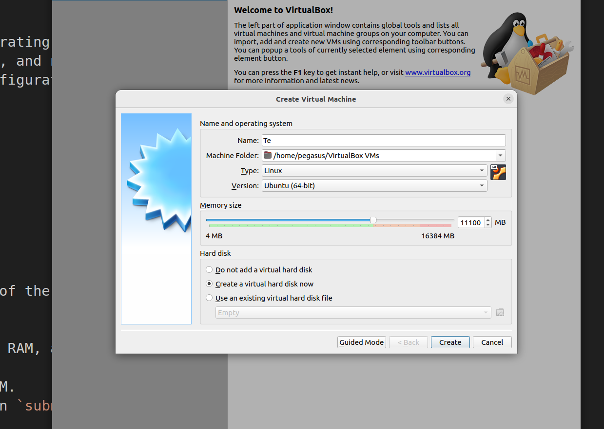
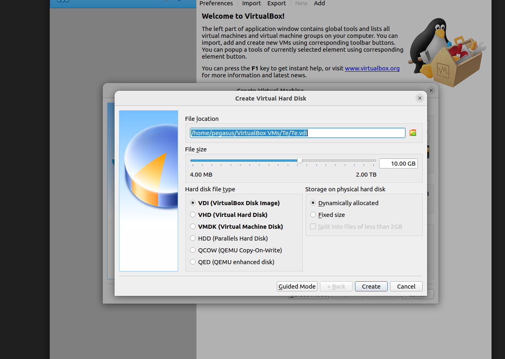
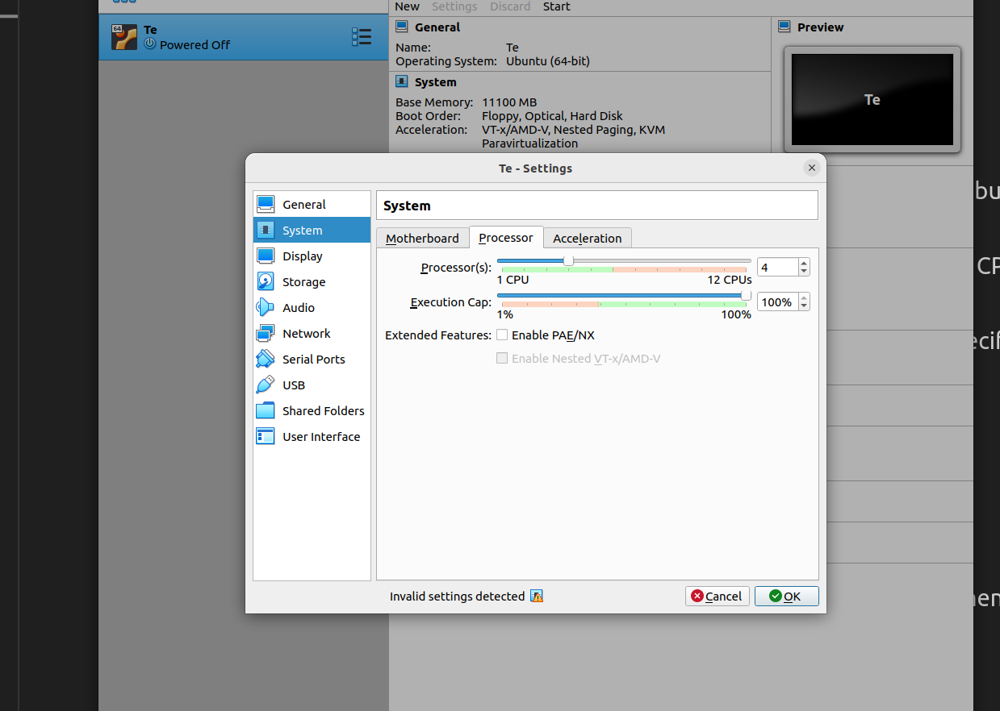
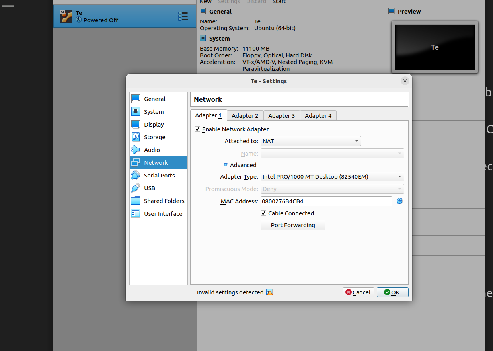
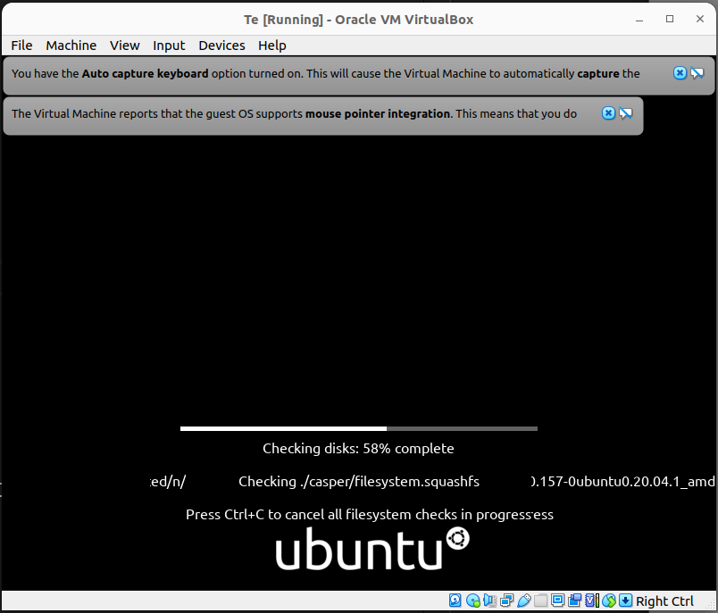
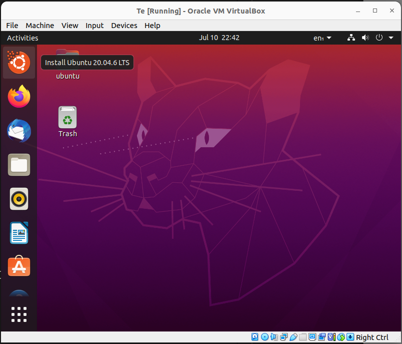
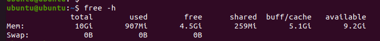
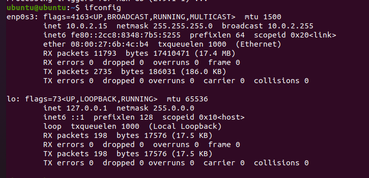
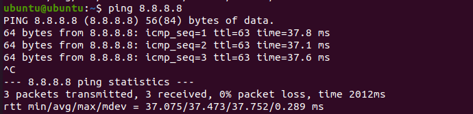

## Task 1: VM Deployment

1. Version of VBox:

VirtualBox Graphical User Interface Version 6.1.50_Ubuntu r161033

2. Steps and configurations made during the VM deployment and configurations made during the VM deployment:

I first defined name and Type of the operating system:
Here we setted up a memory size of approx 11k MB + created Virtual Hard disk of 10 Gb size.

Virtual Hard is also dynamically allocated:

I also added 4 CPU cores:

And setted up NAT:

I then downloaded .iso of Ubuntu 22.04 and launched the system with it:

Then I launch trial mode of ubuntu in order to test the system:

## Task 2: System Information Tools

In orded to check CPU status I used `lscpu`:

Here we can see that the number of cores is exactly as we setted it up. It knows my CPU model and uses the most of it. Architecture is also x64 as intended.

As for ram, i used `free -h`.

The memory size is 10 Gb, exactly as we put it in the settings:

For network information I prefer to use `ifconfig`:

For that i needed to install net-tools. Let's see what we got inside of ifconfig:

Here we do have 1 ethernet network (LAN) coming from my main system, and one loopback for localhost. Everything as intended - I used my one and only NAT for that. 

We can also ping for google to ensure that internet is working:

