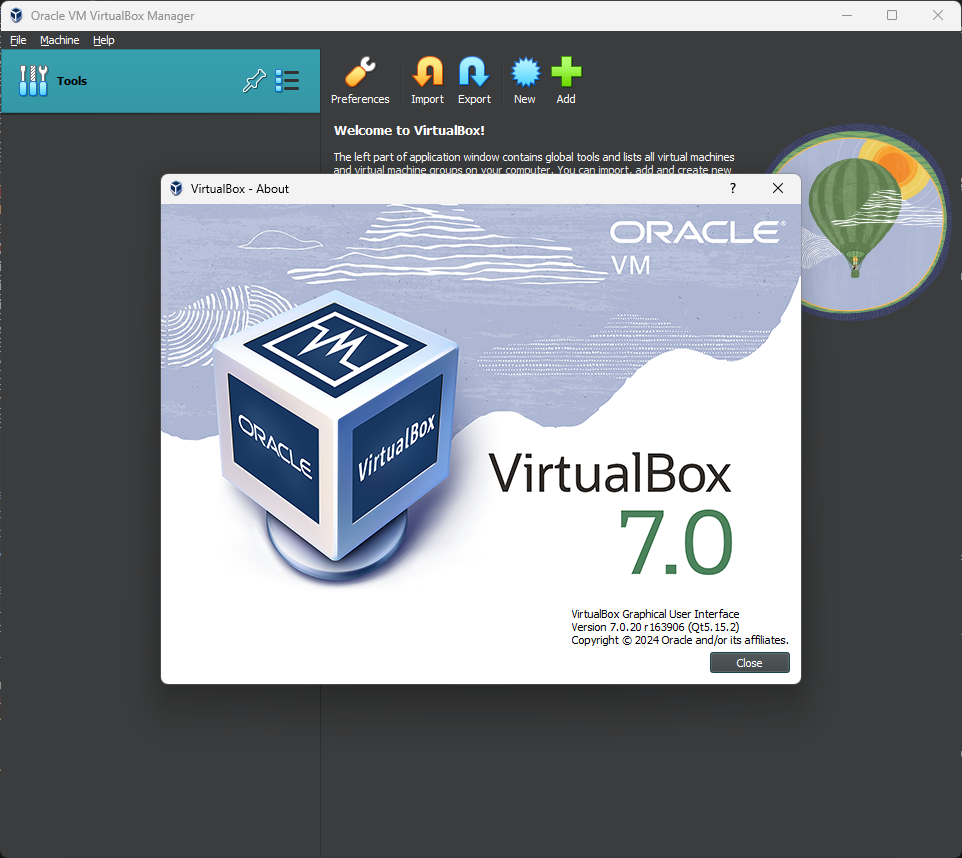
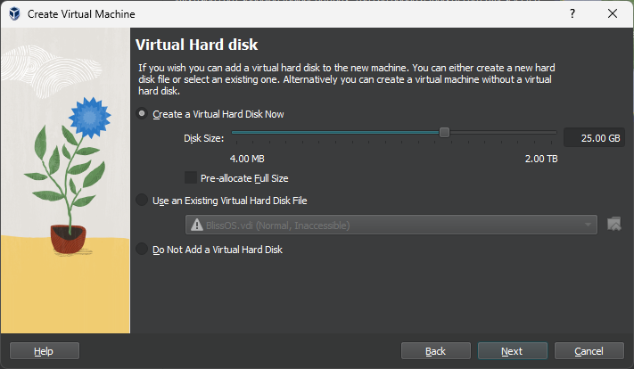
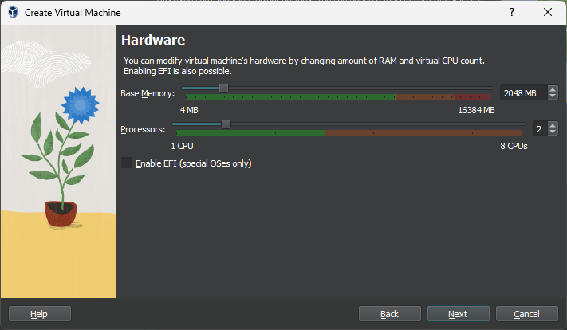
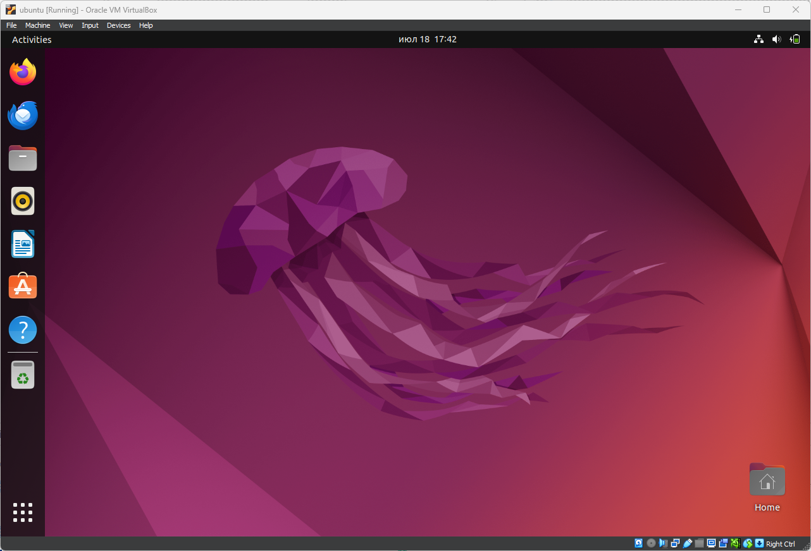
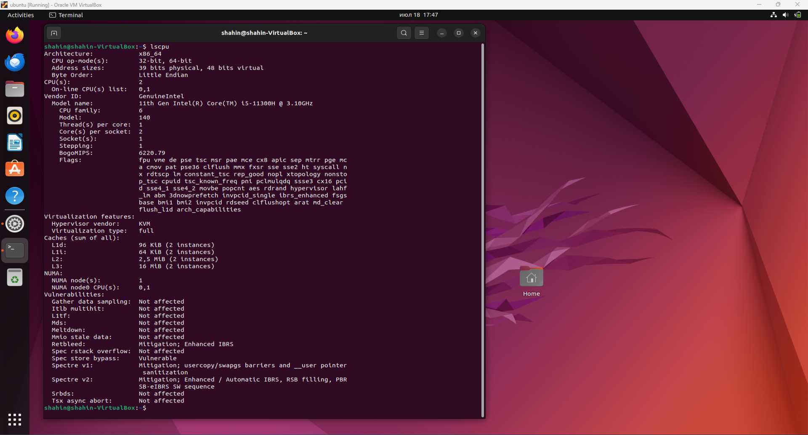
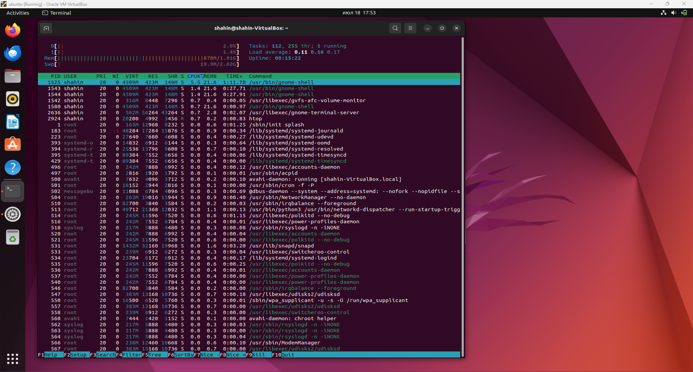
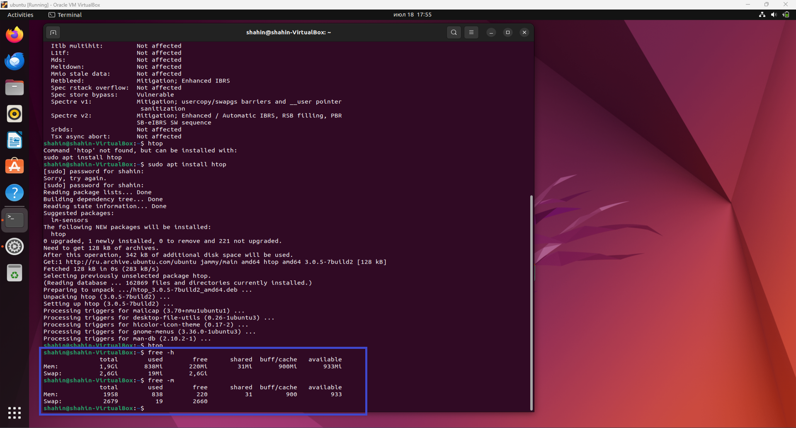
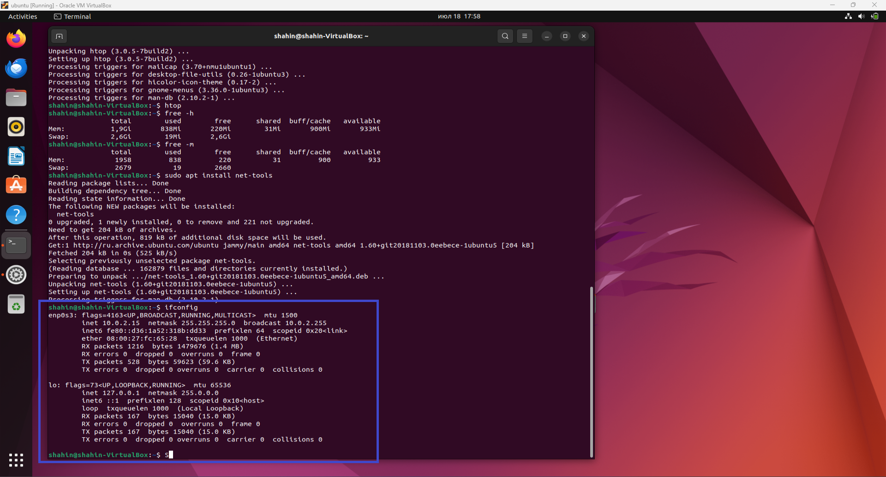
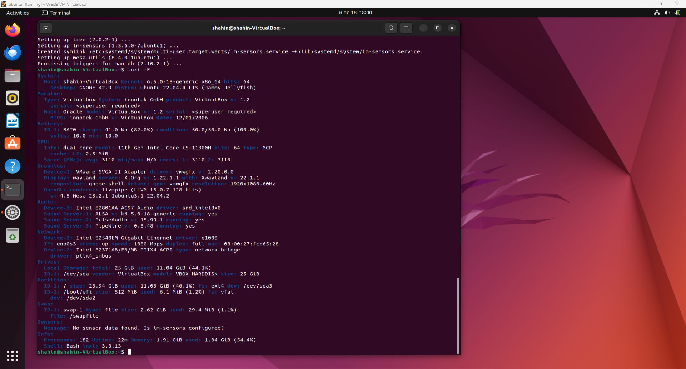

# Virtualization Lab

## Task 1: VM Deployment

**Objective**: Install VirtualBox and deploy a new VM using Ubuntu.

1. **Install VirtualBox**:
   - Download and install VirtualBox from the official [VirtualBox website](https://www.virtualbox.org/).
   - Version number of VirtualBox: 
      
2. **Deploy a Virtual Machine**:
   - Create a new Virtual Machine (VM) using VirtualBox and choose the Ubuntu operating system.
   - Customize the VM settings, such as the allocated memory, number of CPU cores, and network configuration: 

    - Chose ubuntu (64-bit) for OS.
    - Chose 2GB RAM and  2 CPUs.
    - Chose disk as dynamically allocated with 25GB storage capacity.
    - Chose the max amount for video memory 128MB.
    - Chose the ubuntu 22.04 iso image as source for installing the sysytem to the virtual machine.
    
     
     

   - A screenshot of the VM running :
      

## Task 2: System Information Tools

1. **Processor, RAM, and Network Information**:
   - Display Processor Information usin the following command `lscpu` :
      
   
   - displaying the proccess currently runnin use the following: `htop' :
      

   - Display RAM Information using the command  `free -h`  or `free -m ` : 
      

   - Display Network Information :
      - Install net-tools
         - `sudo apt update`
         - `sudo apt install net-tools`

      - Using the command  `ifconfig` :
         

2. **Operating System Specifications**:
   - install the tool using `sudo apt-get install inxi`
      -  `inxi -F` :
      
