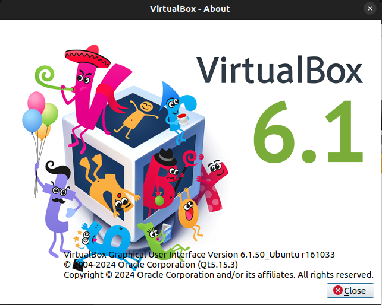
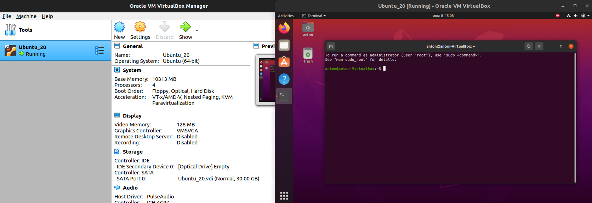

# Lab 7: Virtualization Lab
## Anton Buguev, a.buguev@innopolis.university, M23-RO-01

### Task 1. VM Deployment.

1. Install virtual box: 
    1. I downloaded the latest version from the official software and tried to install it. However, when I tried to laucnh VirtaulBox I got the error:
    ```sh
    WARNING: The vboxdrv kernel module is not loaded. Either there is no module
         available for the current kernel (6.5.0-41-generic) or it failed to
         load. Please recompile the kernel module and install it by

           sudo /sbin/vboxconfig

         You will not be able to start VMs until this problem is fixed.
    ```
    2. I've run the following command that allowed me to install prevoius version which worked successfully:
    ```sh
    sudo apt install --reinstall virtualbox-dkms
    ```
    3. Check VirtaulBox version:

    ```sh
    $ vboxmanage -version

    6.1.50_Ubuntur161033
    ```
    

2. Deploy Virtual Machine
    1. Downloaded **Ubuntu 20** image from official [website](https://releases.ubuntu.com/focal/).
    2. Inside VirtualBox created new Virtual Machine, chose Ubuntu OS, adjusted RAM to 10 GB, created virtual disk and selecetd it as VDI with dynamically allocated memory, adjusted storage size to 30 GB and created virtual machine.
    3. Opened settings for newly created virtual machine and increased number of CPU cores (up to 4) and video monitor memory (up to 128 MB).
    4. After that opened *Storage* in the settings and selected downloaded Ubuntu image as optical disk to install the system.
    5. Now it is time to run virtual machine and follow instructions to install ubuntu. For simplicity I chose minimal installation without downloading updates. When installation is finished, VirtualBox automatically *ejects* the optical disk which is required to fully finish installation and restart the system.

    You can see running VM on the image below with my profile in the terminal:
    