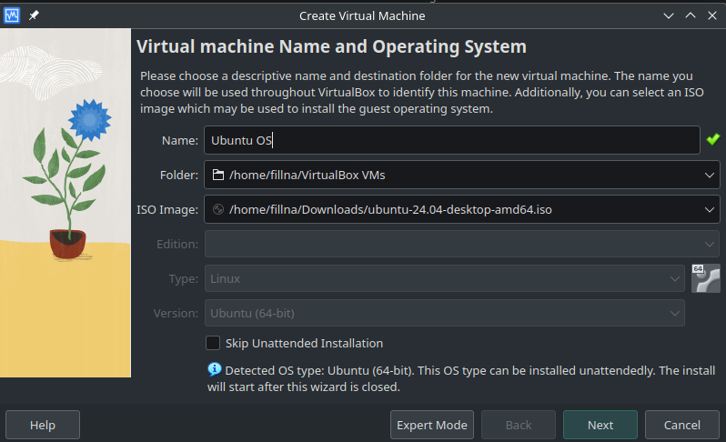
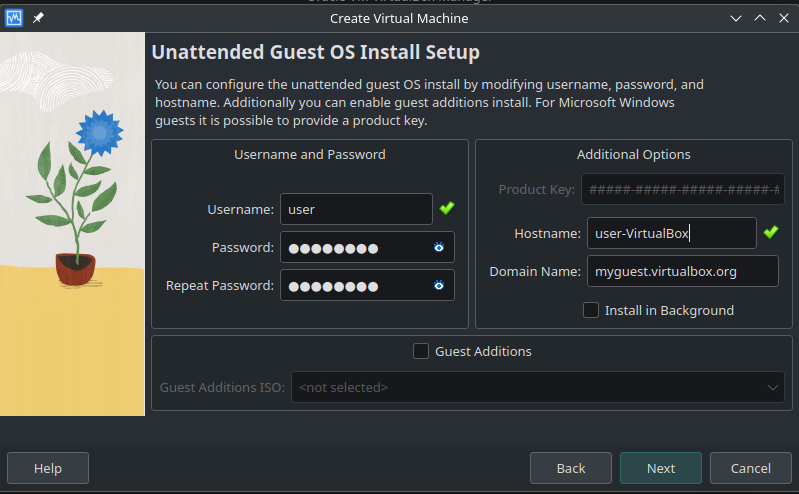
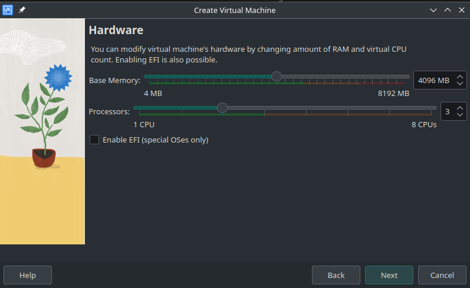
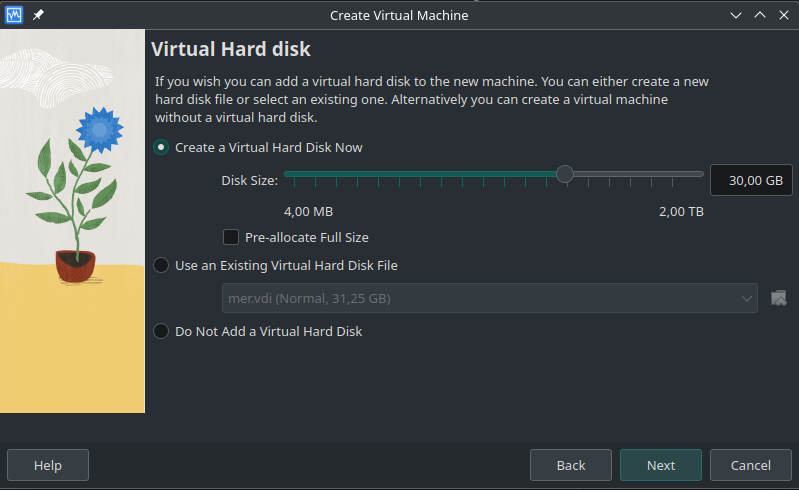
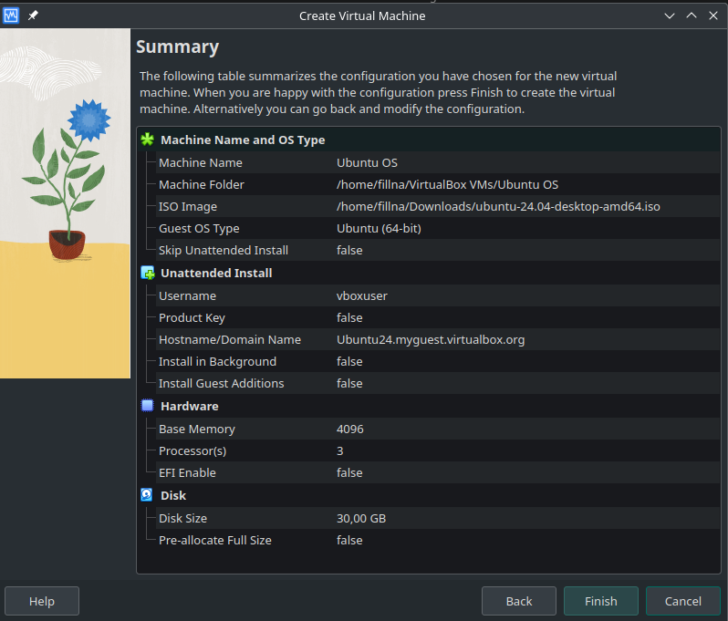
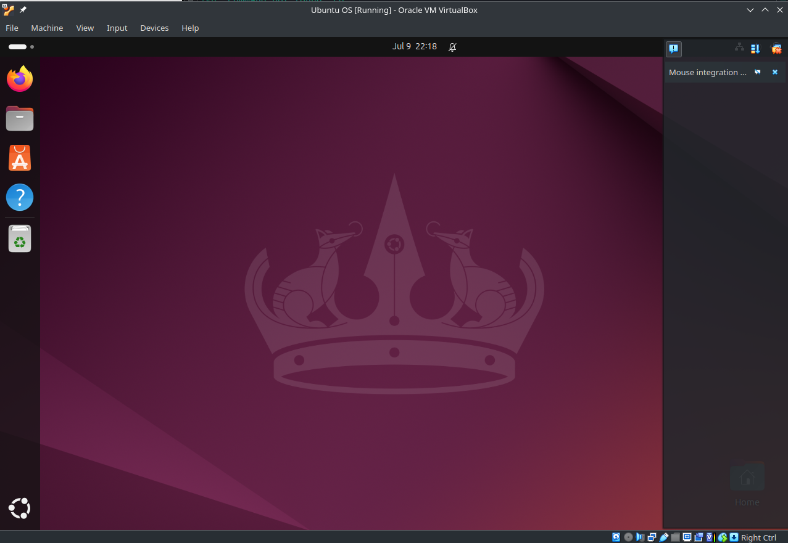
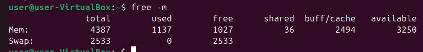
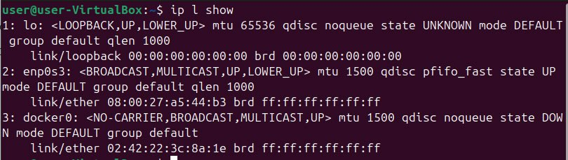

# Task 1:  VM Deployment
## The version of VirtualBox
Oracle VM VirtualBox VM Selector v7.0.18

## Steps and configurations of the VM deployment

### 1. I created a new VM and pointed the Ubuntu installer

### 2. Then I created the password and the hostname

### 3. After that I adjusted Memory and CPU for the VM

### 4. Finally, I set the Disk size

### The VM configuration

### The running VM

# Task 2: System Information Tools

## Processor, RAM, and Network Information

### I used "lcpu" command to display the information about CPU

### "free -m command" to display the information about Memory

### "ip l show" to show the information about the network interface

## Operating System Specification

### "lshw" provides detailed information on the hardware configuration

