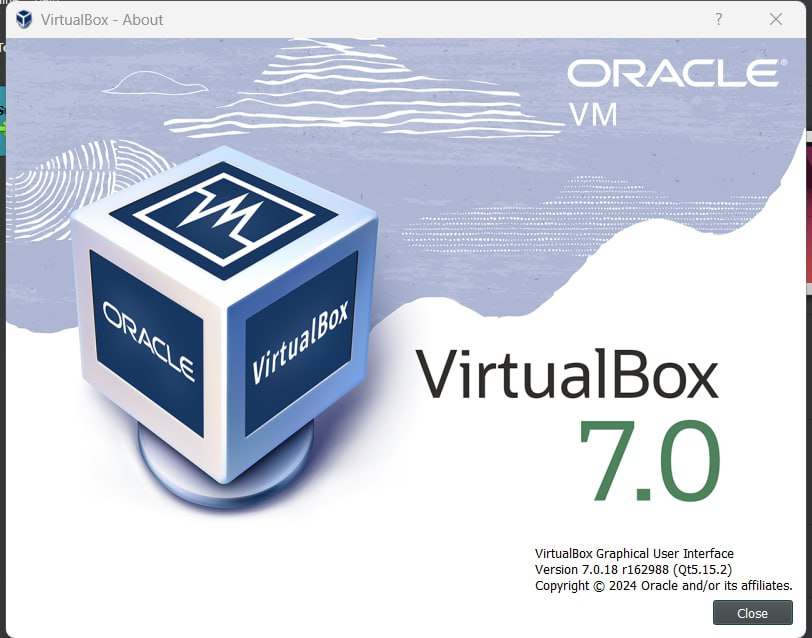
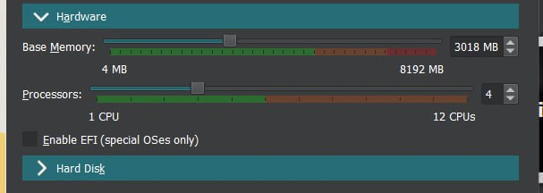
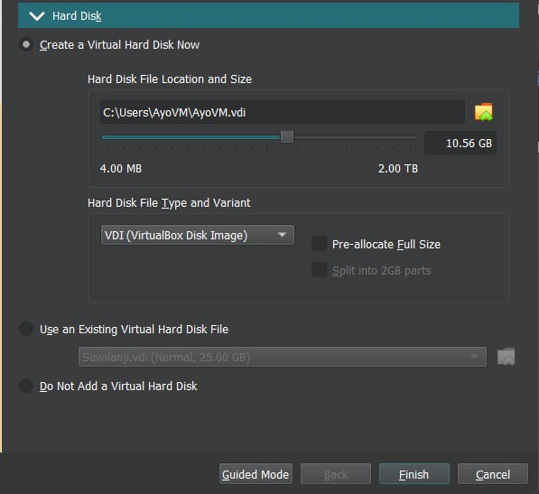
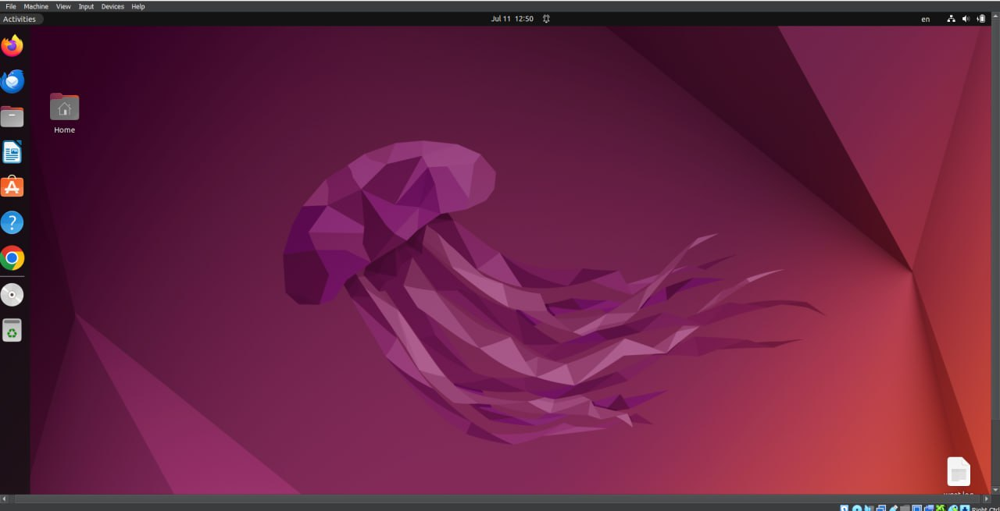

# Virtual Machine Deployment Report

## VirtualBox Version
```
VirtualBox Version: 7.0
```


## Steps and Configurations Made During VM Deployment

### Creating a New VM
```
- Open VirtualBox
- Click on 'New'
- Enter Name of VM: AyoVM
- Select the SO image for the Ubuntu
- Type: Linux
- Version: Ubuntu (64-bit)
- Click 'Next'
```


### Resource Allocation
```
- Memory Size: 3018 MB
- CPU Amount: 4
- Click 'Next'
```



### Hard Disk Creation
```
- Select 'Create a virtual hard disk now'
- Set to 10.56 GB
- Click 'Create'
```



### Hard Disk File Type
```
- Select 'VDI (VirtualBox Disk Image)'
- Click 'Next'
```


#### Display CPU info with lscpu`
```sh
akindeko@ayooluwa:~/Desktop$ lscpu
Architecture:            x86_64
CPU op-mode(s):        32-bit, 64-bit
Address sizes:         39 bits physical, 48 bits virtual
Byte Order:            Little Endian
CPU(s):                  4
On-line CPU(s) list:   0-3
Vendor ID:               GenuineIntel
Model name:            11th Gen Intel(R) Core(TM) i5-11400H @ 2.70GHz
CPU family:          6
Model:               141
Thread(s) per core:  1
Core(s) per socket:  4
Socket(s):           1
Stepping:            1
BogoMIPS:            5376.00
Flags:               fpu vme de pse tsc msr pae mce cx8 apic sep mtrr pge mca cmov pat pse36 clflush mmx fx
sr sse sse2 ht syscall nx rdtscp lm constant_tsc rep_good nopl xtopology nonstop_tsc c
puid tsc_known_freq pni pclmulqdq ssse3 cx16 pcid sse4_1 sse4_2 movbe popcnt aes rdran
d hypervisor lahf_lm abm 3dnowprefetch invpcid_single ibrs_enhanced fsgsbase bmi1 bmi2
invpcid rdseed clflushopt arat md_clear flush_l1d arch_capabilities
Virtualization features:
Hypervisor vendor:     KVM
Virtualization type:   full
Caches (sum of all):

L1d:                   192 KiB (4 instances)
L1i:                   128 KiB (4 instances)
L2:                    5 MiB (4 instances)
L3:                    48 MiB (4 instances)
NUMA:

NUMA node(s):          1
NUMA node0 CPU(s):     0-3
Vulnerabilities:

Gather data sampling:  Not affected
Itlb multihit:         Not affected
L1tf:                  Not affected
Mds:                   Not affected
Meltdown:              Not affected
Mmio stale data:       Not affected
Retbleed:              Mitigation; Enhanced IBRS
Spec rstack overflow:  Not affected
Spec store bypass:     Vulnerable
Spectre v1:            Mitigation; usercopy/swapgs barriers and __user pointer sanitization
Spectre v2:            Mitigation; Enhanced / Automatic IBRS; RSB filling; PBRSB-eIBRS SW sequence; BHI Sysca
ll hardening, KVM SW loop
Srbds:                 Not affected
Tsx async abort:       Not affected
akindeko@ayooluwa:~/Desktop$
```
####  View RAM info with `free h`
```sh
akindeko@ayooluwa:~/Desktop$ free -h
total        used        free      shared  buff/cache   available
Mem:           2.8Gi       1.4Gi       258Mi       216Mi       1.1Gi       1.0Gi
Swap:          2.6Gi       8.0Mi       2.6Gi
akindeko@ayooluwa:~/Desktop$
```
#### Use network information `ip a` to display my
```sh
akindeko@ayooluwa:~/Desktop$ ip a
1: lo: <LOOPBACK,UP,LOWER_UP> mtu 65536 qdisc noqueue state UNKNOWN group default qlen 1000
link/loopback 00:00:00:00:00:00 brd 00:00:00:00:00:00
inet 127.0.0.1/8 scope host lo
valid_lft forever preferred_lft forever
inet6 ::1/128 scope host
valid_lft forever preferred_lft forever
2: enp0s3: <BROADCAST,MULTICAST,UP,LOWER_UP> mtu 1500 qdisc fq_codel state UP group default qlen 1000
link/ether 08:00:27:84:56:1c brd ff:ff:ff:ff:ff:ff
inet 10.0.2.15/24 brd 10.0.2.255 scope global dynamic noprefixroute enp0s3
valid_lft 85959sec preferred_lft 85959sec
inet6 fe80::60de:e4c2:86ef:b7de/64 scope link noprefixroute
valid_lft forever preferred_lft forever
akindeko@ayooluwa:~/Desktop$
```
#### Used `neofetch` to display VM OS specs.
```sh
sudo apt install neofetch
```
```sh
neofetch
```


## Screenshot of Running VM


