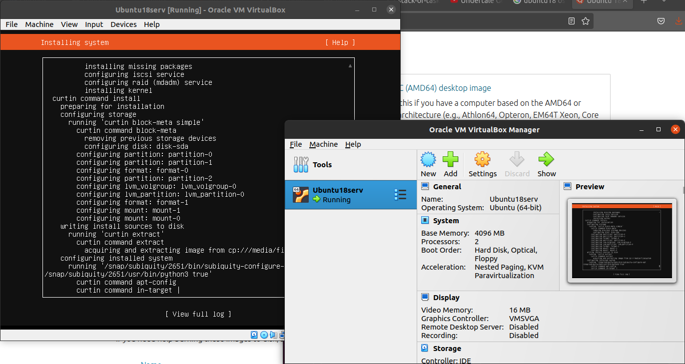
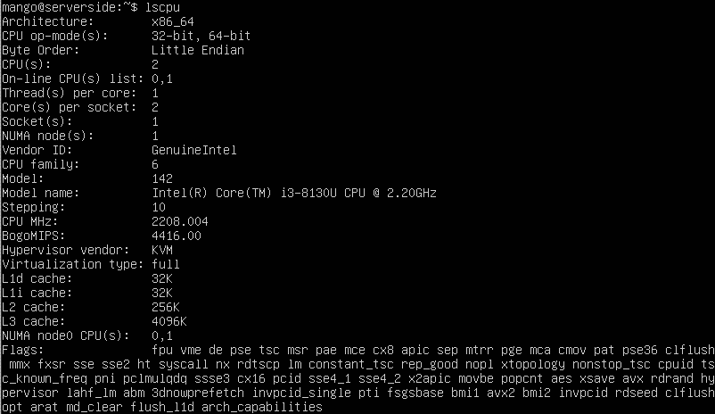
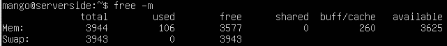
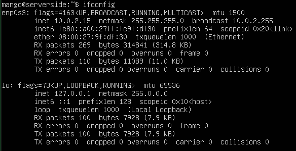
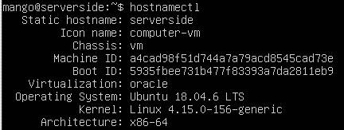

# Lab 7

## Task 1

### VirtualBox version
7.0.18 r162988 (Qt5.12.8)

### Steps taken in deploying the VM
1. Chosen system: Ubuntu 18 (Bionic Beaver, 64-bit). For simplicity, server pack was chosen
2. Base Memory: 4096 MB
3. Processors: 2 CPUs
4. Allocated virtual hard disk of 50.80 GB

### Running VM




## Task 2

Сommand-line tools to display system information of the VM:

| | command-line  | output|
|-|---------------|-------|
|Processor| ```lscpu```| |
|RAM |  ```free -m```| ||
| Network| ```ifconfig```| |
|   OS Specs | ```hostnamectl```| |