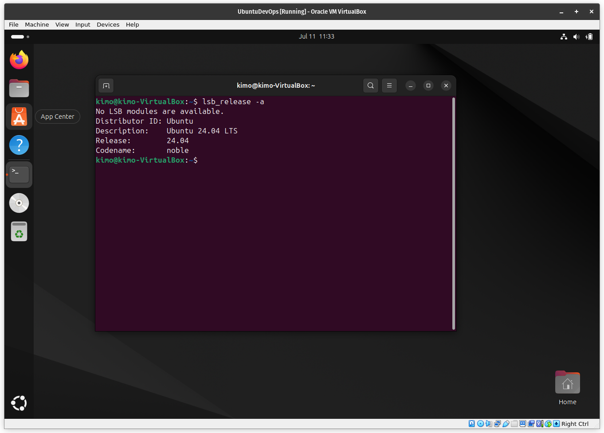

# Virtualization Lab

## Task 1: VM Deployment

VirtualBox Version number: 7.0.18 [ref](./assets/virtualbox-version.png)

### Deploying Ubuntu on VirtualBox

- Download Ubuntu ISO image from [official website](https://ubuntu.com/download)
- Click the `New` button on virtualbox app [ref](./assets/virtualbox-main.png)
- Set the Name of the virtual machine
- Select the downloaded ISO image by clicking the drop down on ISO Image field and selecting your ISO image file [ref](./assets/virtual-box-select1.png) (you can choose `Other` if your ISO image is not on the list and find the ISO image from your files), click `Next` button
- Set appropriate memory and processors according to recommendation from [official website](https://ubuntu.com/download/desktop#system-requirements), click `Next` button [ref](./assets/virtualbox-set-memory-cpu.png)
- Set appropriate disk size as per recoomendation from [official website](https://ubuntu.com/download/desktop#system-requirements), click `Next` button [ref](./assets/virtualbox-set-disk-size.png)
- Review summary and click `Finish` button [ref](./assets/virtualbox-summary.png)
- Click `Start` button to start your virtual machine [ref](./assets/virtualbox-start.png)
- Select `Try or Install Ubuntu` in the menu [ref](./assets/virtualbox-grub.png)
- Follow the [official instruction](https://ubuntu.com/tutorials/install-ubuntu-desktop#5-installation-setup) from step 5 to step 12

