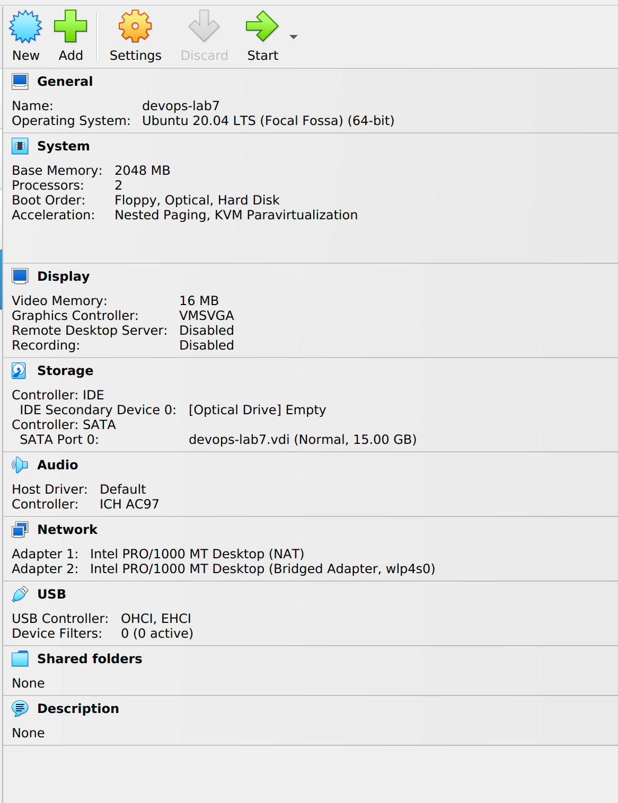
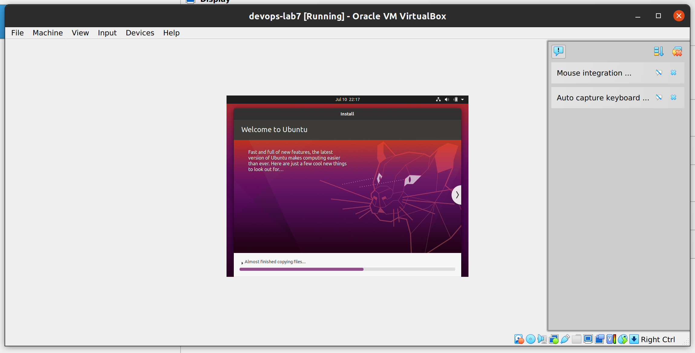
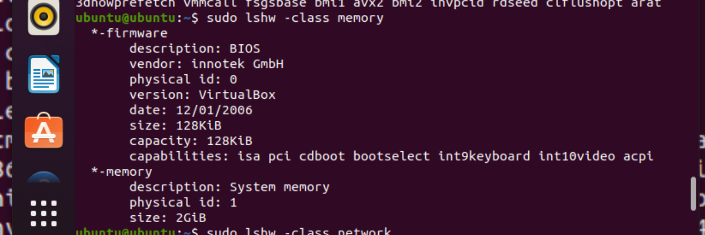
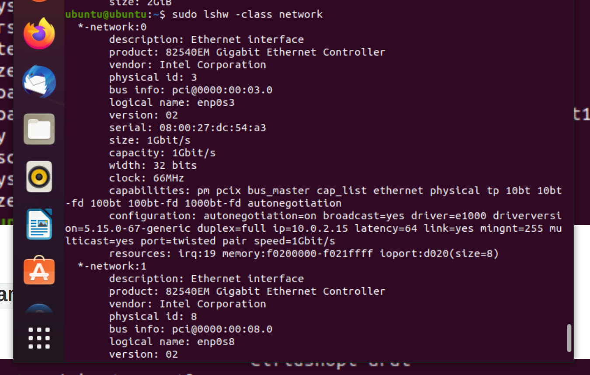
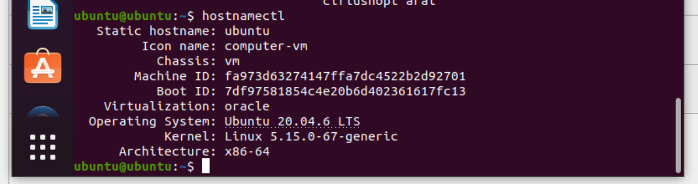
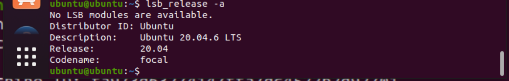

# Lab 7 submission

## Task 1

### VirtualBox version

### Creating an Ubuntu VM

I used the setup wizard in expert mode in order to customize memory, CPU, and disk allocation.

Here is my customized VM configuration:

- Ubuntu 22.04 LTS
- 15GB disk
- 2GB memory
- 2 CPU cores
- 2 network adapters (default and one bridge adapter)

### Running VM

## Task 2

Commands for the status of the VM:

### `lshw` for CPU, RAM and network info

We can use the lshw tool, the commands and outputs are included in the screenshots below.

### OS Spec with `hostnamectl`

We can simply use the `hostnamectl` command to get the info. Another alternative is `lsb_release -a`, which we include the output below as well.

