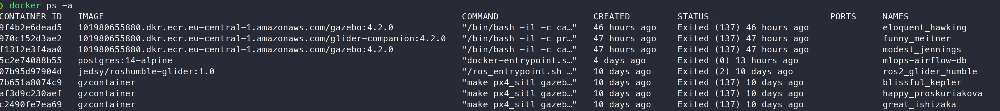
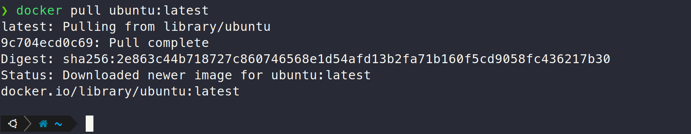
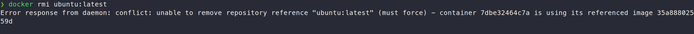
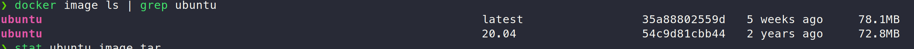
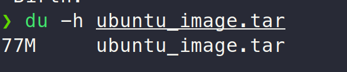
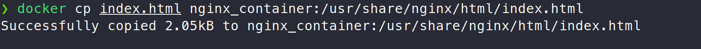
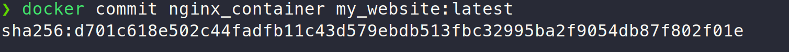
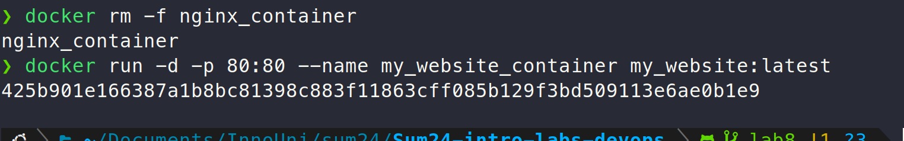
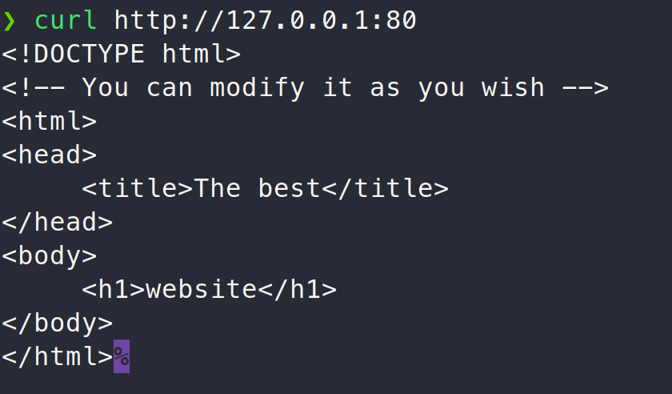
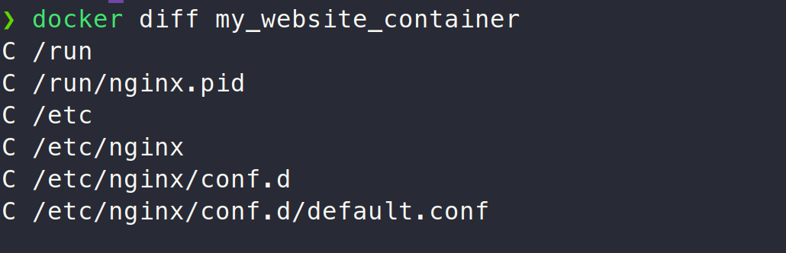

# Lab 8 submission

## Task 1

### List containers

### Pull latest Ubuntu image

### Run an Ubuntu container

> We notice that by running the container with the `-it` argument, we connect to a bash shell inside the container. We did not specify the command for the container, which suggests that the container entrypoint is `/bin/bash` .

### Attempting to remove the Ubuntu image

> We cannot remove the image because the container that we just created is referencing it.

## Task 2

### Saving the Ubuntu image to a file

After using the command `docker save -o ubuntu_image.tar ubuntu:latest` to save the image to a .tar file. We compare the size of the file to the size of the image:

We can see that the file is almost the same size as the image itself. This is because the `docker save` command saves the image to a tarball, which is uncompressed.

### Running an nginx container

> I had to first stop a default Apache server that was using port 80 using `sudo systemctl stop apache2.service`.

The website is accessible once the container is up and running:

### Set up the website homepage

### Commit container

### Remove old container and run a new container from the saved image

### Accessing the website

### Docker diff

> We notice that 2 files are changed in the container, compared to the image. The files are shown in the screenshot and their parent directories are also marked as changed. Some automatic changes happened to the default.conf file, and the nginx.pid file was updated because nginx got a new PID when we started the container.

