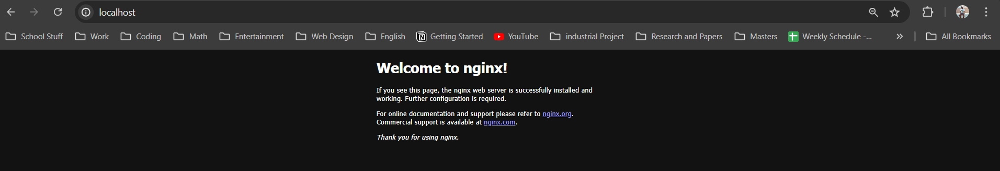
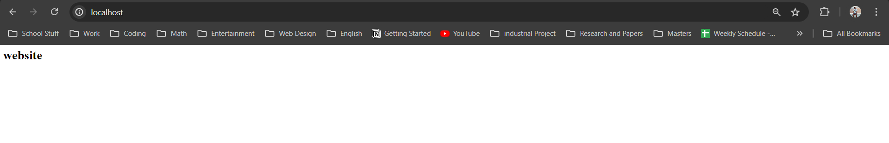

# Lab 8 : Containers Lab - Docker

## Task 1: Container Management
1. **List Containers**: 
- using `docker ps -a` lists all the containers in my environement 
     ```sh
    PowerShell 7.4.3
    PS C:\Users\suwil\Desktop\First Year Masters\Third Semester\Devops\Lab 8>  docker ps -a
    CONTAINER ID   IMAGE                          COMMAND                  CREATED        STATUS                      PORTS                    NAMES
    cf4857aaa210   fffffc90d343                   "/docker-entrypoint.…"   13 days ago    Exited (0) 13 days ago                               YetAnotherName
    12c57468e671   ipfs/go-ipfs                   "/sbin/tini -- /usr/…"   3 weeks ago    Exited (0) 3 weeks ago                               ipfs_host
    614806b541f7   lbsserver-lbs                  "python3 -m flask ru…"   7 weeks ago    Exited (137) 7 weeks ago                             lbsserver-lbs-1
    c4618b8216fe   postgres:15.7                  "docker-entrypoint.s…"   7 weeks ago    Exited (0) 7 weeks ago                               lbsserver-db-1
    25b0f2ea3a79   suwilanji/lbs_image            "python3 -m flask ru…"   2 months ago   Exited (0) 2 months ago                              pedantic_herschel
    85d0aa037549   suwilanji/telegrambot          "docker-entrypoint.s…"   3 months ago   Exited (137) 3 months ago                            distracted_goldstine
    0fae4714205f   suwilanji/telegrambot          "docker-entrypoint.s…"   3 months ago   Exited (1) 3 months ago                              quizzical_benz
    0d6ff86fedad   suwilanji/calorielogger        "java -jar /CalorieL…"   3 months ago   Up 43 seconds                                        quizzical_franklin
    f105fba70de0   suwilanji/telegrambot          "docker-entrypoint.s…"   3 months ago   Up 34 seconds               0.0.0.0:3000->3000/tcp   nifty_kirch
    2c0de721cdc2   suwilanji/calorielogger        "java -jar /CalorieL…"   3 months ago   Exited (130) 3 months ago                            zealous_kowalevski
    9f962e5d092c   suwilanji/telegrambot:latest   "docker-entrypoint.s…"   3 months ago   Exited (1) 3 months ago                              dazzling_bhaskara
    PS C:\Users\suwil\Desktop\First Year Masters\Third Semester\Devops\Lab 8>
     ```

2. **Pull Latest Ubuntu Image**:
     ```sh
    PS C:\Users\suwil\Desktop\First Year Masters\Third Semester\Devops\Lab 8> docker pull ubuntu:latest
    latest: Pulling from library/ubuntu
    9c704ecd0c69: Pull complete
    Digest: sha256:2e863c44b718727c860746568e1d54afd13b2fa71b160f5cd9058fc436217b30
    Status: Downloaded newer image for ubuntu:latest
    docker.io/library/ubuntu:latest

    What's Next?
    View a summary of image vulnerabilities and recommendations → docker scout quickview ubuntu:latest
     ```

3. **Run Container**:
- Using `docker pull` i pulled the lastest version of the ubuntu image:

    ```sh
    PS C:\Users\suwil\Desktop\First Year Masters\Third Semester\Devops\Lab 8> docker run -it --name ubuntu_container ubuntu:latest
    root@c11b68020031:/# ls
    bin  boot  dev  etc  home  lib  lib64  media  mnt  opt  proc  root  run  sbin  srv  sys  tmp  usr  var
    root@c11b68020031:/# exit
    exit
    ```
- Using `docker ps` we can see that the container is running 
     ```sh
    PS C:\Users\suwil\Desktop\First Year Masters\Third Semester\Devops\Lab 8> docker ps
    CONTAINER ID   IMAGE           COMMAND       CREATED         STATUS         PORTS     NAMES
    c11b68020031   ubuntu:latest   "/bin/bash"   6 minutes ago   Up 8 seconds             ubuntu_container
     ```

4. **Remove Image**:
- Attempting to remove the image gives as error as it is still referenced by `ubuntu_container` which we created earlier.
     ```sh
    PS C:\Users\suwil\Desktop\First Year Masters\Third Semester\Devops\Lab 8> docker rmi ubuntu:latest
    Error response from daemon: conflict: unable to remove repository reference "ubuntu:latest" (must force) - container c11b68020031 is using its referenced image 35a88802559dPS C:\Users\suwil\Desktop\First Year Masters\Third Semester\Devops\Lab 8>
     ```
- To resolve this we can first remove the container(s) that is referencing th image , then we can remove the image:
     ```sh
    PS C:\Users\suwil\Desktop\First Year Masters\Third Semester\Devops\Lab 8> docker rm ubuntu_container
    ubuntu_container
    PS C:\Users\suwil\Desktop\First Year Masters\Third Semester\Devops\Lab 8> docker rmi ubuntu:latest
    Untagged: ubuntu:latest
    Untagged: ubuntu@sha256:2e863c44b718727c860746568e1d54afd13b2fa71b160f5cd9058fc436217b30
    Deleted: sha256:35a88802559dd2077e584394471ddaa1a2c5bfd16893b829ea57619301eb3908
    Deleted: sha256:a30a5965a4f7d9d5ff76a46eb8939f58e95be844de1ac4a4b452d5d31158fdea
    PS C:\Users\suwil\Desktop\First Year Masters\Third Semester\Devops\Lab 8>
     ```
## Task 2: Image and Container Operations

1. **Create Image Archive**:
     ```sh
    PS C:\Users\suwil\Desktop\First Year Masters\Third Semester\Devops\Lab 8> docker pull ubuntu:latest
    latest: Pulling from library/ubuntu
    9c704ecd0c69: Pull complete
    Digest: sha256:2e863c44b718727c860746568e1d54afd13b2fa71b160f5cd9058fc436217b30
    Status: Downloaded newer image for ubuntu:latest
    docker.io/library/ubuntu:latest

    What's Next?
    View a summary of image vulnerabilities and recommendations → docker scout quickview ubuntu:latest
    PS C:\Users\suwil\Desktop\First Year Masters\Third Semester\Devops\Lab 8> docker save -o ubuntu_image.tar ubuntu:latest
    PS C:\Users\suwil\Desktop\First Year Masters\Third Semester\Devops\Lab 8> ls

        Directory: C:\Users\suwil\Desktop\First Year Masters\Third Semester\Devops\Lab 8

    Mode                 LastWriteTime         Length Name
    ----                 -------------         ------ ----
    -a---          15/07/2024    23:51       80571904 ubuntu_image.tar

    PS C:\Users\suwil\Desktop\First Year Masters\Third Semester\Devops\Lab 8> docker images ubuntu:latest
    REPOSITORY   TAG       IMAGE ID       CREATED       SIZE
    ubuntu       latest    35a88802559d   5 weeks ago   78.1MB
     ```
- Here i noticed that the size is roufy the same, with the archive being silghter larger (by 2mb).

2. **Run Nginx Container**:
     ```sh
     PS C:\Users\suwil\Desktop\First Year Masters\Third Semester\Devops\Lab 1\Sum24-intro-labs> docker run -d -p 80:80 --name nginx_container nginx
     Unable to find image 'nginx:latest' locally
     latest: Pulling from library/nginx
     f11c1adaa26e: Pull complete
     c6b156574604: Pull complete
     ea5d7144c337: Pull complete
     1bbcb9df2c93: Pull complete
     537a6cfe3404: Pull complete
     767bff2cc03e: Pull complete
     adc73cb74f25: Pull complete
     Digest: sha256:67682bda769fae1ccf5183192b8daf37b64cae99c6c3302650f6f8bf5f0f95df
     Status: Downloaded newer image for nginx:latest
     d4e4119cf31a1e4e96fdcaed0c8c3b6e41edc5df1482a79e5f693a41f3ca90f4
     PS C:\Users\suwil\Desktop\First Year Masters\Third Semester\Devops\Lab 1\Sum24-intro-labs>
     ```
- Opening `localhost:80` confirms that `nginx` is successfully installed.

     

3. **Create HTML File**:

     ```sh
     PS C:\Users\suwil\Desktop\First Year Masters\Third Semester\Devops\Lab 1\Sum24-intro-labs> docker cp index.html nginx_container:/usr/share/nginx/html/index.html
     Successfully copied 2.05kB to nginx_container:/usr/share/nginx/html/index.html
     PS C:\Users\suwil\Desktop\First Year Masters\Third Semester\Devops\Lab 1\Sum24-intro-labs>
     ```
- Opening `localhost:80` now opens the shows the uodated index.html content.

    

4. **Create Custom Image**:
     ```sh
     PS C:\Users\suwil\Desktop\First Year Masters\Third Semester\Devops\Lab 1\Sum24-intro-labs> docker commit nginx_container my_website:latest
     sha256:098e15aacd2ef25e93dd186e72ae5cf2af94d87b074f23c185e80d2995a85c74
     PS C:\Users\suwil\Desktop\First Year Masters\Third Semester\Devops\Lab 1\Sum24-intro-labs> docker images
     REPOSITORY                TAG              IMAGE ID       CREATED          SIZE
     my_website                latest           098e15aacd2e   37 seconds ago   188MB
     nginx                     latest           fffffc90d343   3 weeks ago      188MB
     ipfs/go-ipfs              latest           2eac8d47ed7d   5 weeks ago      95.1MB
     ubuntu                    latest           35a88802559d   5 weeks ago      78.1MB
     lbs_test_d                latest           38493e3f3a7f   7 weeks ago      111MB
     lbsserver-lbs             latest           7fe4035bdec2   7 weeks ago      111MB
     postgres                  15.7             93c8b6f9c1a2   2 months ago     425MB
     suwilanji/lbs_image       latest           cb48c4fd3a8e   2 months ago     111MB
     lbs_test_1                latest           7b3a8be1cdf4   2 months ago     111MB
     <none>                    <none>           9da43074789b   2 months ago     111MB
     ipfs/go-ipfs              <none>           71f8fff78bb2   3 months ago     94.6MB
     suwilanji/calorielogger   latest           b17c4f5724d0   3 months ago     390MB
     suwilanji/telegrambot     latest           5d5344c67c15   3 months ago     197MB
     <none>                    <none>           f1ceee0211ce   3 months ago     212MB
     node                      lts-alpine3.19   09c27ad02af8   3 months ago     135MB
     PS C:\Users\suwil\Desktop\First Year Masters\Third Semester\Devops\Lab 1\Sum24-intro-labs>
     ```

5. **Remove Original Container**:
- Show current containers and see that `nginx_container` exists:
     ```sh
     PS C:\Users\suwil\Desktop\First Year Masters\Third Semester\Devops\Lab 1\Sum24-intro-labs> docker ps -a
     CONTAINER ID   IMAGE                          COMMAND                  CREATED          STATUS                           PORTS                NAMES
     d4e4119cf31a   nginx                          "/docker-entrypoint.…"   10 minutes ago   Up 9 minutes                     0.0.0.0:80->80/tcp   nginx_container
     12c57468e671   ipfs/go-ipfs                   "/sbin/tini -- /usr/…"   3 weeks ago      Exited (0) 3 weeks ago                                ipfs_host
     614806b541f7   lbsserver-lbs                  "python3 -m flask ru…"   7 weeks ago      Exited (137) 7 weeks ago                              lbsserver-lbs-1
     c4618b8216fe   postgres:15.7                  "docker-entrypoint.s…"   7 weeks ago      Exited (0) 7 weeks ago                                lbsserver-db-1
     25b0f2ea3a79   suwilanji/lbs_image            "python3 -m flask ru…"   2 months ago     Exited (0) 2 months ago                               pedantic_herschel
     85d0aa037549   suwilanji/telegrambot          "docker-entrypoint.s…"   3 months ago     Exited (137) 3 months ago                             distracted_goldstine
     0fae4714205f   suwilanji/telegrambot          "docker-entrypoint.s…"   3 months ago     Exited (1) 3 months ago                               quizzical_benz
     0d6ff86fedad   suwilanji/calorielogger        "java -jar /CalorieL…"   3 months ago     Exited (143) About an hour ago                        quizzical_franklin
     f105fba70de0   suwilanji/telegrambot          "docker-entrypoint.s…"   3 months ago     Exited (137) About an hour ago                        nifty_kirch
     2c0de721cdc2   suwilanji/calorielogger        "java -jar /CalorieL…"   3 months ago     Exited (130) 3 months ago                             zealous_kowalevski
     9f962e5d092c   suwilanji/telegrambot:latest   "docker-entrypoint.s…"   3 months ago     Exited (1) 3 months ago                               dazzling_bhaskara
     ```
- Remove the container:
     ```sh
     PS C:\Users\suwil\Desktop\First Year Masters\Third Semester\Devops\Lab 1\Sum24-intro-labs> docker rm -f nginx_container
     nginx_container
     ```
- check again to confirm that it has been removed:
     ```sh
     PS C:\Users\suwil\Desktop\First Year Masters\Third Semester\Devops\Lab 1\Sum24-intro-labs> docker ps -a
     CONTAINER ID   IMAGE                          COMMAND                  CREATED        STATUS                           PORTS     NAMES
     12c57468e671   ipfs/go-ipfs                   "/sbin/tini -- /usr/…"   3 weeks ago    Exited (0) 3 weeks ago                     ipfs_host
     614806b541f7   lbsserver-lbs                  "python3 -m flask ru…"   7 weeks ago    Exited (137) 7 weeks ago                   lbsserver-lbs-1
     c4618b8216fe   postgres:15.7                  "docker-entrypoint.s…"   7 weeks ago    Exited (0) 7 weeks ago                     lbsserver-db-1
     25b0f2ea3a79   suwilanji/lbs_image            "python3 -m flask ru…"   2 months ago   Exited (0) 2 months ago                    pedantic_herschel
     85d0aa037549   suwilanji/telegrambot          "docker-entrypoint.s…"   3 months ago   Exited (137) 3 months ago                  distracted_goldstine
     0fae4714205f   suwilanji/telegrambot          "docker-entrypoint.s…"   3 months ago   Exited (1) 3 months ago                    quizzical_benz
     0d6ff86fedad   suwilanji/calorielogger        "java -jar /CalorieL…"   3 months ago   Exited (143) About an hour ago             quizzical_franklin
     f105fba70de0   suwilanji/telegrambot          "docker-entrypoint.s…"   3 months ago   Exited (137) About an hour ago             nifty_kirch
     2c0de721cdc2   suwilanji/calorielogger        "java -jar /CalorieL…"   3 months ago   Exited (130) 3 months ago                  zealous_kowalevski
     9f962e5d092c   suwilanji/telegrambot:latest   "docker-entrypoint.s…"   3 months ago   Exited (1) 3 months ago                    dazzling_bhaskara
     PS C:\Users\suwil\Desktop\First Year Masters\Third Semester\Devops\Lab 1\Sum24-intro-labs>
     ```

6. **Create New Container**:
  
     ```sh
     PS C:\Users\suwil\Desktop\First Year Masters\Third Semester\Devops\Lab 1\Sum24-intro-labs>  docker run -d -p 80:80 --name my_website_container my_website:latest
     abec9b24d274af05468ccd85814225a77d1e8f901161c7c8f37208e32d79bc83
     PS C:\Users\suwil\Desktop\First Year Masters\Third Semester\Devops\Lab 1\Sum24-intro-labs>
     ```
     ```sh
     PS C:\Users\suwil\Desktop\First Year Masters\Third Semester\Devops\Lab 1\Sum24-intro-labs> docker ps -a
     CONTAINER ID   IMAGE                          COMMAND                  CREATED          STATUS                           PORTS                NAMES
     abec9b24d274   my_website:latest              "/docker-entrypoint.…"   25 seconds ago   Up 24 seconds                    0.0.0.0:80->80/tcp   my_website_container
     ```

7. **Test Web Server**:
     ```sh
     PS C:\Users\suwil\Desktop\First Year Masters\Third Semester\Devops\Lab 1\Sum24-intro-labs> curl http://127.0.0.1:80
     <html>

     <head>
     <title>The best</title>
     </head>

     <body>
     <h1>website</h1>
     </body>

     </html>
     PS C:\Users\suwil\Desktop\First Year Masters\Third Semester\Devops\Lab 1\Sum24-intro-labs>
     ```

8. **Analyze Image Changes**:
     ```sh
     PS C:\Users\suwil\Desktop\First Year Masters\Third Semester\Devops\Lab 1\Sum24-intro-labs> docker diff my_website_container
     C /run
     C /run/nginx.pid
     C /etc
     C /etc/nginx
     C /etc/nginx/conf.d
     C /etc/nginx/conf.d/default.conf
     PS C:\Users\suwil\Desktop\First Year Masters\Third Semester\Devops\Lab 1\Sum24-intro-labs>
     ```
- The command above shows that servral chnages have occured in the `/run` and `/etc` directories  for instance `/run/ngin.pid` shows that the PID file created by the nginx process was modified.