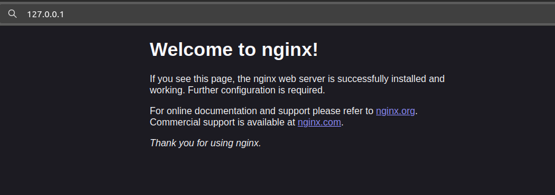

# Lab 8

## Task 1


### List containers

1. Command and its output:
```
$ docker ps -a
CONTAINER ID   IMAGE          COMMAND                  CREATED       STATUS                   PORTS     NAMES
aea4cd28c64b   hello-world    "/hello"                 2 weeks ago   Exited (0) 2 weeks ago             suspicious_leavitt
f23377466cfc   ipfs/go-ipfs   "/sbin/tini -- /usr/…"   3 weeks ago   Exited (0) 3 weeks ago             ipfs_host
```

2. Pull the latest Ubuntu image:
```
$ docker pull ubuntu:latest
latest: Pulling from library/ubuntu
9c704ecd0c69: Pull complete 
Digest: sha256:2e863c44b718727c860746568e1d54afd13b2fa71b160f5cd9058fc436217b30
Status: Downloaded newer image for ubuntu:latest
docker.io/library/ubuntu:latest
```

3. Run the container:
```
$ docker run -it --name ubuntu_container ubuntu:latest
	root@ccebfeba0e4b:/#
```
The container opened a the pulled ubuntu terminal with my own. Checking the image's specs:
```
    root@ccebfeba0e4b:/home# free -m
               total        used        free      shared  buff/cache   available
Mem:            1879         396        1360           0         256        1483
Swap:           1023           0        1023

```
4. Remove image - container removal attemp failed, output:
```
root@ccebfeba0e4b:/home# exit
exit

mango@shmango:~$ docker rmi ubuntu:latest

Error response from daemon: conflict: unable to remove repository reference "ubuntu:latest" (must force) - container ccebfeba0e4b is using its referenced image 35a88802559d
```

## Task 2

1. Pull the latest Ubuntu image and create an archive file from it.
```
docker save -o ubuntu_image.tar ubuntu:latest
```
No output given.

Compare sizes:
|original image| archive file|
|--------------|-------------|
|78.05 MB|80.6 MB|

Archive file is larger by 2.1 MB

2. Run Nginx Container:

```
$ docker run -d -p 80:80 --name nginx_container nginx
Unable to find image 'nginx:latest' locally
latest: Pulling from library/nginx
f11c1adaa26e: Pull complete 
c6b156574604: Pull complete 
ea5d7144c337: Pull complete 
1bbcb9df2c93: Pull complete 
537a6cfe3404: Pull complete 
767bff2cc03e: Pull complete 
adc73cb74f25: Pull complete 
Digest: sha256:67682bda769fae1ccf5183192b8daf37b64cae99c6c3302650f6f8bf5f0f95df
Status: Downloaded newer image for nginx:latest
48e5fd74d586da6f1f65b8a78264c6369bbc0ce1d4c1ab4b85d31de5c50635f4
```

Verifying that the server is running at ```127.0.0.1:80```:



3. Create and copy the ```.html``` file
```
$ docker cp  index.html nginx_container:/usr/share/nginx/html/index.html
Successfully copied 2.05kB to nginx_container:/usr/share/nginx/html/index.html
```

4. Create custom image:
```
$ docker commit nginx_container my_website:latest
sha256:3e72d48a81859f6086e7ebb7d5bfed31a0e94514a8d00c209de46846ab4332c1
```

5. Remove original container and create a new one
```
$ docker rm -f nginx_container
nginx_container

$ docker run -d -p 80:80 --name my_website_container my_website:latest
5824ccd5a5b8b88a8e587458ce067b22f732685ee34f29dc10bbe6bfefd10309

```
7. Test the web server:
```
$ curl http://127.0.0.1:80
<html>
<head>
<title>The best</title>
</head>
<body>
<h1>website</h1>
</body>
</html>
```


8. Analyze image changes
```
$ docker diff my_website_container
C /run
C /run/nginx.pid
C /etc
C /etc/nginx
C /etc/nginx/conf.d
C /etc/nginx/conf.d/default.conf
```

The output contains a list of changes directories marked with ```C``` at the front