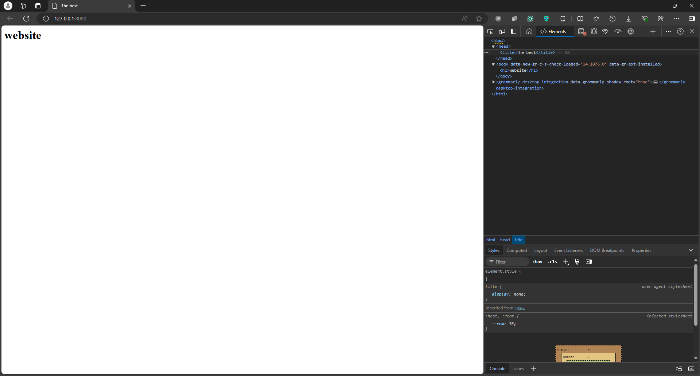

# Containers Lab - Docker

In this lab, you will gain hands-on experience with Docker, a popular containerization platform. You will perform various tasks related to Docker containers, such as listing and pulling images, running containers, and creating custom images. Follow the tasks below to complete the lab assignment.

## Task 1: Container Management

**Objective**: Manage Docker containers and images.

1. **List Containers**:
   - Use the appropriate command to list the Docker containers present in your environment.

    -  ```sh
       docker ps -a
       ```
    - Output :
      ``` ruby 
        PS G:\shahin> docker ps -a
        CONTAINER ID   IMAGE          COMMAND                  CREATED             STATUS                            PORTS                                                                                        NAMES
        642b3c77dc63   ipfs/go-ipfs   "/sbin/tini -- /usr/…"   About an hour ago   Exited (255) About a minute ago   0.0.0.0:4001->4001/tcp, 0.0.0.0:5001->5001/tcp, 4001/udp, 0.0.0.0:8080->8080/tcp, 8081/tcp   ipfs_host      
      ```


2. **Pull Latest Ubuntu Image**:
   - Use the appropriate command to pull the latest Ubuntu image from the Docker registry.

     - ```sh
         docker pull ubuntu:latest
        ```
     - Output: 
       ``` ruby 
        PS G:\shahin> docker pull ubuntu:latest
        latest: Pulling from library/ubuntu
        9c704ecd0c69: Pull complete
        Digest: sha256:2e863c44b718727c860746568e1d54afd13b2fa71b160f5cd9058fc436217b30
        Status: Downloaded newer image for ubuntu:latest
        docker.io/library/ubuntu:latest

        What's Next?
          View a summary of image vulnerabilities and recommendations → docker scout quickview ubuntu:latest
       ```

3. **Run Container**:
   - Use the appropriate command to run a container using the Ubuntu image you just pulled.

    - ```sh
      docker run -it --name ubuntu_container ubuntu:latest
      ```
    - Output:
      ``` ruby 
      root@459dd46498c4:/# exit
      exit
      ``` 
4. **Remove Image**:
   - Attempt to remove the Ubuntu image you pulled earlier.

    -  ```sh
       docker rmi ubuntu:latest
       ```
    - Output :
      ``` ruby 
      PS G:\shahin> docker rmi ubuntu:latest
      Error response from daemon: conflict: unable to remove repository reference "ubuntu:latest" (must force) - container bb65d2ee3af3 is using its referenced image 35a88802559d
      ```
    - we need to stop it then delete it as follows:
    
      ``` ruby
      PS G:\shahin> docker rm bb65d2ee3af3
      >>
      bb65d2ee3af3

      PS G:\shahin> docker rmi ubuntu:latest
      Untagged: ubuntu:latest
      Untagged: ubuntu@sha256:2e863c44b718727c860746568e1d54afd13b2fa71b160f5cd9058fc436217b30
      Deleted: sha256:35a88802559dd2077e584394471ddaa1a2c5bfd16893b829ea57619301eb3908
      Deleted: sha256:a30a5965a4f7d9d5ff76a46eb8939f58e95be844de1ac4a4b452d5d31158fdea
      ```  

## Task 2: Image and Container Operations

**Objective**: Perform operations on Docker images and containers.

1. **Create Image Archive**:
   - Pull the latest Ubuntu image and create an archive file from it.

     ```sh
     docker save -o ubuntu_image.tar ubuntu:latest
     ```

   - Compare the size of the archive file with the size of the original image.
      ``` ruby 
      PS G:\shahin> docker images ubuntu:latest
      REPOSITORY   TAG       IMAGE ID       CREATED       SIZE
      ubuntu       latest    35a88802559d   5 weeks ago   78.1MB
      ```
      ``` ruby 
      ls  G:\shahin\ubuntu_image.tar   

      Directory: G:\shahin

      Mode                 LastWriteTime         Length Name
      ----                 -------------         ------ ----
      -a----         7/18/2024   7:11 PM       80569344 ubuntu_image.tar
      ```
2. **Run Nginx Container**:

   - Use the appropriate command to run a container using the Nginx web server image:
     - Bind the container's port 80 to the local port 80.
     - Run the container in detached mode and name it `nginx_container`.

     - ```sh
       docker run -d -p 80:80 --name nginx_container nginx
       ```
      - Output :
        ``` ruby
        PS G:\shahin> docker run -d -p 80:80 --name nginx_container nginx
        Unable to find image 'nginx:latest' locally
        latest: Pulling from library/nginx
        f11c1adaa26e: Pull complete
        c6b156574604: Pull complete
        ea5d7144c337: Pull complete
        1bbcb9df2c93: Pull complete
        537a6cfe3404: Pull complete
        767bff2cc03e: Pull complete
        adc73cb74f25: Pull complete
        Digest: sha256:67682bda769fae1ccf5183192b8daf37b64cae99c6c3302650f6f8bf5f0f95df
        Status: Downloaded newer image for nginx:latest
        069fbfc5896f8252a06660f9055816d56ddc1fb27fcba3a42a3e049ed1e9825c
        ``` 

   - Verify that the web server is running and accessible from the local machine.

3. **Create HTML File**:
   - Create an HTML file with the specified content:

     ```html
     <html>
     <head>
     <title>The best</title>
     </head>
     <body>
     <h1>website</h1>
     </body>
     </html>
     ```

   - Copy the HTML file to the container at the appropriate location to serve as an index file.

    -  ```sh
       docker cp index.html nginx_container:/usr/share/nginx/html/index.html
        ```

    - Output :

        ``` ruby 
        PS G:\shahin> docker cp G:\shahin\lab8\index.html  nginx_container:/usr/share/nginx/html/index.html
        Successfully copied 2.05kB to nginx_container:/usr/share/nginx/html/index.html
        ```   

4. **Create Custom Image**:
   - Create a custom Docker image from the running container and name it `my_website`.
   - Tag the container with the `latest` tag.

    -  ```sh
       docker commit nginx_container my_website:latest
       ```
    - Output:
        ``` ruby 
        PS G:\shahin> docker commit nginx_container my_website:latest
        sha256:2453be1a68beaa9135dad2df8d9a6546a34a1146623269e5c954ddb60621c213
         ``` 
5. **Remove Original Container**:
   - Remove the original container (`nginx_container`) and verify that it has been successfully removed.

    -  ```sh
       docker rm -f nginx_container
       ```
    - Output :
      ``` ruby
      PS G:\shahin> docker rm -f nginx_container
      nginx_container
      ```


6. **Create New Container**:
   - Create a new container using the custom image you've created (the same way as the original container).

    -  ```sh
       docker run -d -p 8080:80 --name my_website_container my_website:latest
       ```
    - Output: 
      ``` ruby 
      PS G:\shahin> docker run -d -p 8080:80 --name my_website_container my_website:latest
      afb46509197f010fe16d1afbbab6a48c41d3f1b8e8a9cd88620066a8a282864d
      ```


7. **Test Web Server**:
   - Use the `curl` command to access the web server at `127.0.0.1:80`.

    -  ```sh
       curl http://127.0.0.1:8080
       ```
        

    - Output:
      ``` ruby 

      PS G:\shahin> curl http://127.0.0.1:8080

      StatusCode        : 200
      StatusDescription : OK
      Content           : <html>
                          <head>
                          <title>The best</title>
                          </head>
                          <body>
                          <h1>website</h1>
                          </body>
                          </html>
      RawContent        : HTTP/1.1 200 OK
                          Connection: keep-alive
                          Accept-Ranges: bytes
                          Content-Length: 92
                          Content-Type: text/html
                          Date: Thu, 18 Jul 2024 16:32:43 GMT
                          ETag: "66994021-5c"
                          Last-Modified: Thu, 18 Jul 2024 16...
      Forms             : {}
      Headers           : {[Connection, keep-alive], [Accept-Ranges, bytes], [Content-Length, 92], [Content-Type, text/html]...}
      Images            : {}
      InputFields       : {}
      Links             : {}
      ParsedHtml        : mshtml.HTMLDocumentClass
      RawContentLength  : 92
      ```

8. **Analyze Image Changes**:
   - Use the `docker diff` command to analyze the changes made to the new image.

   -   ```sh
       docker diff my_website_container
       ```
   - output:
      ``` ruby 
      PS G:\shahin> docker diff my_website_container
      C /run
      C /run/nginx.pid
      C /etc
      C /etc/nginx
      C /etc/nginx/conf.d
      C /etc/nginx/conf.d/default.conf
      ```
    - Explanation :
    
      `A` : A file or directory was added.

      `D` : A file or directory was deleted.

      `C` : A file or directory was changed.

