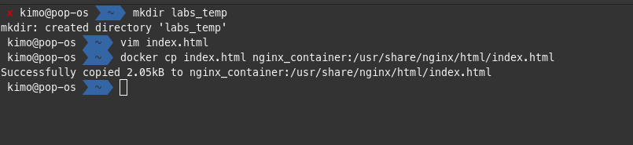

# Containers Lab - Docker

## Task 1: Container Management

1. List Containers:  
    Command: `docker ps -a`
   
2. Pull Latest Ubuntu Image:  
    Command: `docker pull ubuntu:latest`
   
3. Run Container:  
   Command: `docker run -it --name ubuntu_container ubuntu:latest`
   
4. Remove Image:  
   Command: `docker rmi ubuntu:latest`
   

## Task 2: Image and Container Operations

1. Create Image Archive:  
    Command: `docker save -o ubuntu_image.tar ubuntu:latest`
   
   Remarks: The archive file (`77M`) seems to be slightly smaller than the original image (`78.1MB`).
2. Run Nginx Container:  
   Command: `docker run -d -p 80:80 --name nginx_container nginx`
   
   [web server running on `http://localhost`](./assets/docker-nginx-web-ref.png)
3. Create HTML File:  
    Command: `docker cp index.html nginx_container:/usr/share/nginx/html/index.html`
   
   [web output of index.html `http://localhost`](./assets/docker-cp-nginx-index-web-ref.png)
4. Create Custom Image:  
    Command: `docker commit nginx_container my_website:latest`
   
5. Remove Original Container:  
   Command: `docker rm -f nginx_container`
   
6. Create New Container:  
    Command: `docker run -d -p 80:80 --name my_website_container my_website:latest`
   
7. Test Web Server:  
    Command: `curl http://127.0.0.1:80`
   
8. Analyze Image Changes:  
    Command: `docker diff my_website_container`
     
   Remarks: `C` in the output of `docker diff` command means that the file or directory specified after the `C` was modified. Therefore all the files and directories listed in the screenshot were modified.
