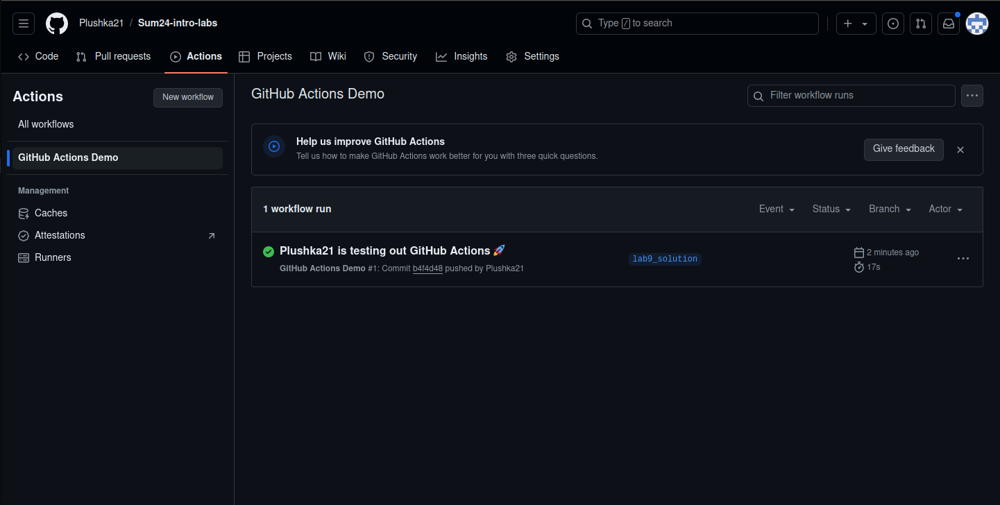
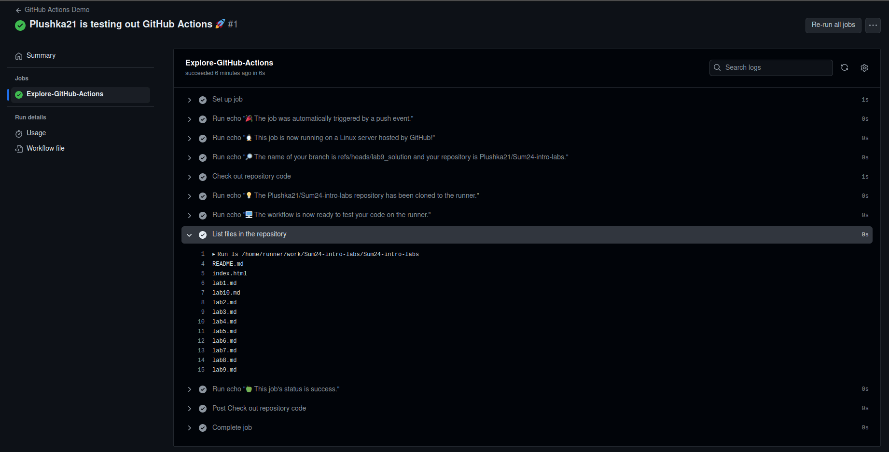
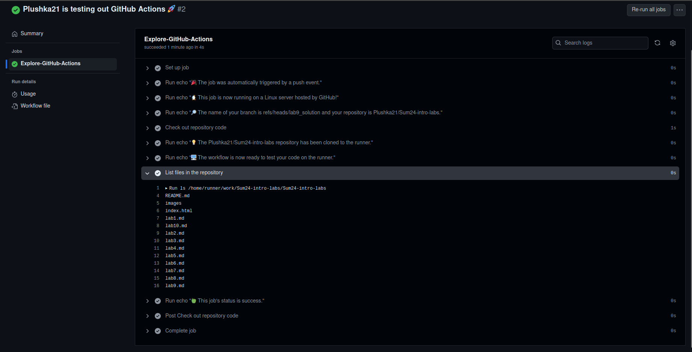

# Lab 9: CI/CD Lab - GitHub Actions
## Anton Buguev, a.buguev@innopolis.university, M23-RO-01

### Task 1. Create Your First GitHub Actions Pipelineю

1. According to official [tutorial](https://docs.github.com/en/actions/quickstart) create directory `.github/workflows` and inside that directory create file `github-actions-demo.yml`:
```yaml
name: GitHub Actions Demo
run-name: ${{ github.actor }} is testing out GitHub Actions 🚀
on: [push]
jobs:
  Explore-GitHub-Actions:
    runs-on: ubuntu-latest
    steps:
      - run: echo "🎉 The job was automatically triggered by a ${{ github.event_name }} event."
      - run: echo "🐧 This job is now running on a ${{ runner.os }} server hosted by GitHub!"
      - run: echo "🔎 The name of your branch is ${{ github.ref }} and your repository is ${{ github.repository }}."
      - name: Check out repository code
        uses: actions/checkout@v4
      - run: echo "💡 The ${{ github.repository }} repository has been cloned to the runner."
      - run: echo "🖥️ The workflow is now ready to test your code on the runner."
      - name: List files in the repository
        run: |
          ls ${{ github.workspace }}
      - run: echo "🍏 This job's status is ${{ job.status }}."
```

2. Commit and push changes to `lab9_solution` branch. After that create pull request to the main branch. This action created demo GitHub action


3. If we select this GitHub action we can see what actions exactly were performed, for example, list files in repository


4. If we commit and push changes it would automatically trigger new github action, for example, this time I commited folder `images` with 1 image inside and we can see that in GitHub Action #2 we get updated list of directories:
