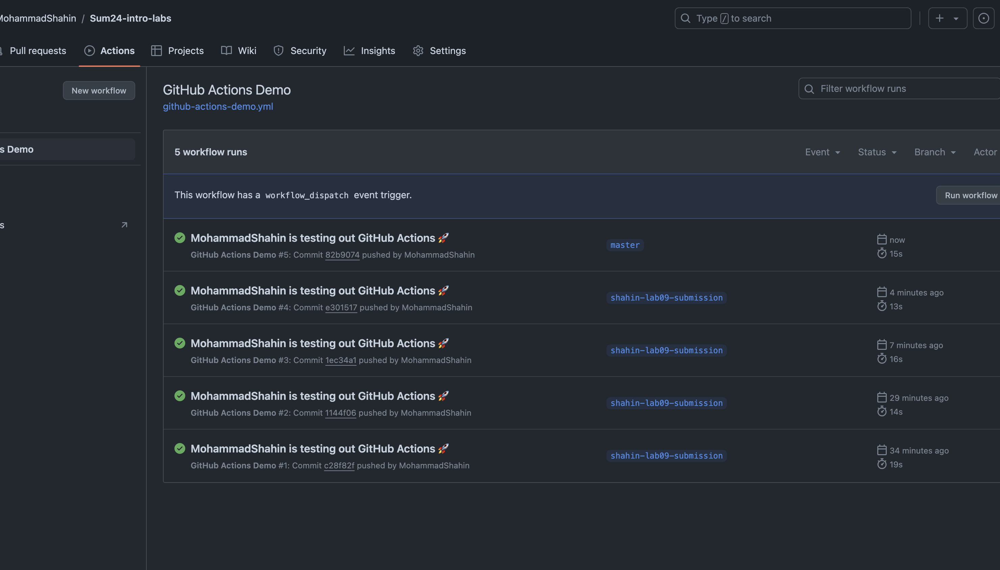
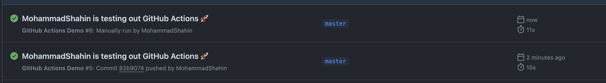
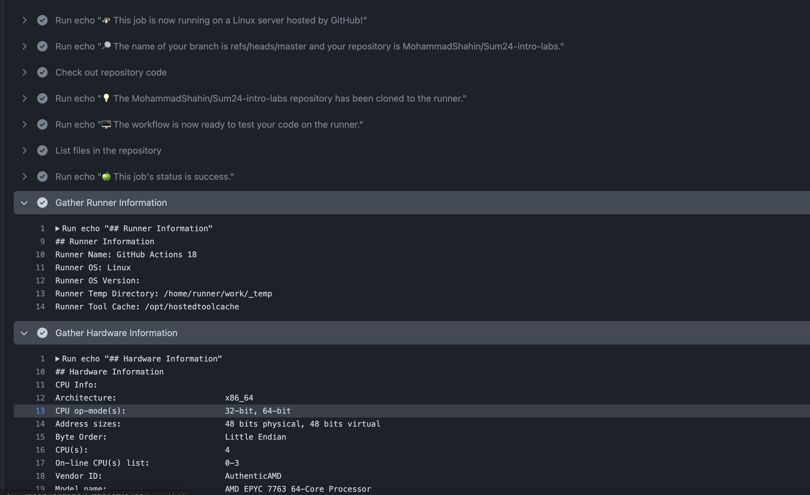
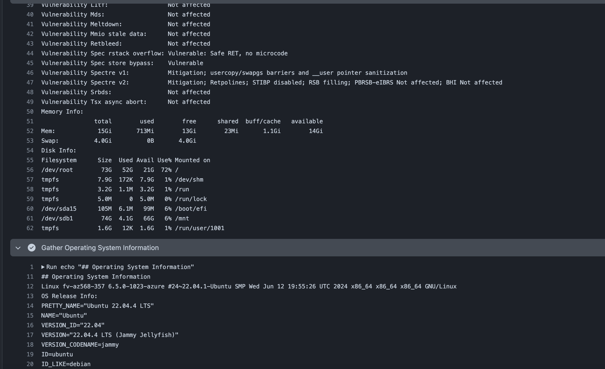

## Task 1

Github actions is a platform for CI/CD. We can manage builds, tests, deployments using Github actions. Github actions work by creating a workflow that specifies what needs to be done (commands) and when (what triggers a workflow to start). A workflow is just a pipeline of jobs that needs to be done. A trigger (event) can be a pull request, new commit, manual, etc. For example, we can have a workflow in a repository of a website that deploys to AWS on every pull request. The jobs of this workflow would be cloning the repository, installing the dependencies, running the tests, and finally pushing to AWS with the correct credentials. If any of these jobs fail, the site won't reflect the changes from the latest pull request. 

To add a new workflow, we just needs to create a new folder `.github/workflows` and add workflow file there. The workflow is a yaml file that specifies what jobs need to executed. We also specify the events that trigger the execution of the said workflow. In the quick start case, it's push. We created `github-actions-demo.yml` that contains a single job. This job has multiple steps: it echos the repository's name, user, and the files in the github. 

The workflow worked as expected without any errors.


After a new push, the workflow was triggered. No error were found in the execution.


## Task 2

### Part 1

Now we need to make the workflow manually triggerable. This is done by adding `workflow_dispatch` to the events list. However, according to the documentation "this trigger only receives events when the workflow file is on the default branch". Thus even if we pushed workflow to a non-master branch, the workflow won't be munually triggerable. Thus we need to have it in the master branch.

So we should do this in the master branch. After moving the workflow to the default branch (master), this is what we get in the actions tab. 



We can now manually trigger the workflow. 



### Part 2

Now we need to update the workflow to gather the runner information. We added the following steps to the job. We show info about the runner using env variables. We also linux commands (lscpu, free, df, etc.) for more details.

```
      - name: Gather Runner Information
        run: |
          echo "## Runner Information"
          echo "Runner Name: $RUNNER_NAME"
          echo "Runner OS: $RUNNER_OS"
          echo "Runner OS Version: $RUNNER_OS_VERSION"
          echo "Runner Temp Directory: $RUNNER_TEMP"
          echo "Runner Tool Cache: $RUNNER_TOOL_CACHE"
          
      - name: Gather Hardware Information
        run: |
          echo "## Hardware Information"
          echo "CPU Info:"
          lscpu
          echo "Memory Info:"
          free -h
          echo "Disk Info:"
          df -h
          
      - name: Gather Operating System Information
        run: |
          echo "## Operating System Information"
          uname -a
          echo "OS Release Info:"
          cat /etc/os-release
          echo "Kernel Version:"
          uname -r
          echo "Host Information:"
          hostnamectl
```

The output can be found here:




