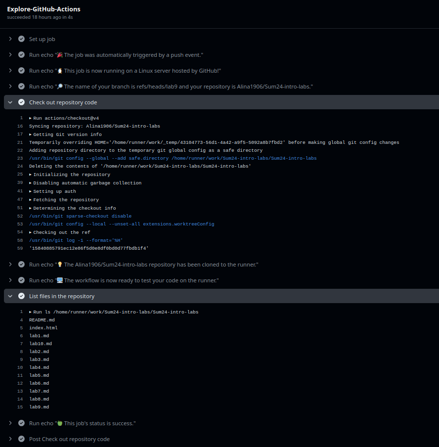
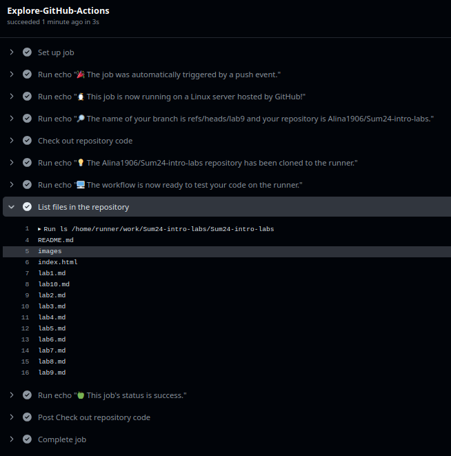
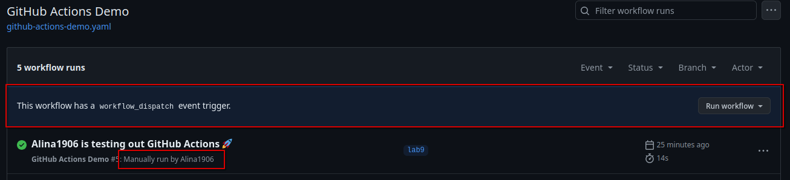
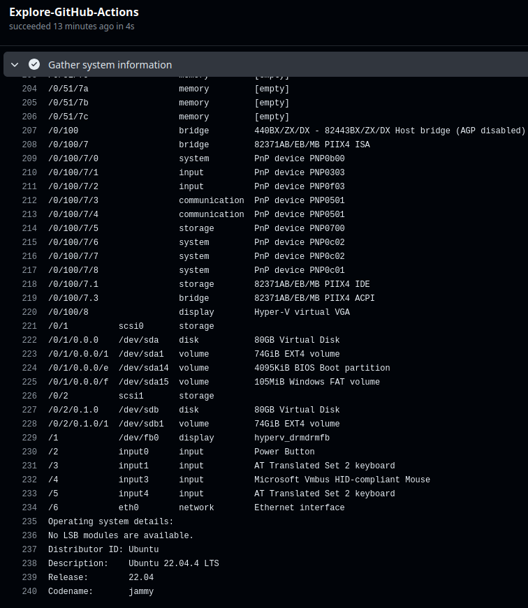

# Task 1: Creating the GitHub actions pipeline

## Following the [Quickstart guide](https://docs.github.com/en/actions/quickstart)
1. I created a workflow yaml file including the path to automatically run several jobs using the command:
```
$ mkdir -p .github/workflows/ && touch .github/workflows/github-actions-demo.yaml
```
2. I added the worfkow provided by Github as an example in the yaml file.
There is a file content:
```
$ cat ./.github/workflows/github-actions-demo.yaml
name: GitHub Actions Demo
run-name: ${{ github.actor }} is testing out GitHub Actions 🚀
on: [push]
jobs:
  Explore-GitHub-Actions:
    runs-on: ubuntu-latest
    steps:
      - run: echo "🎉 The job was automatically triggered by a ${{ github.event_name }} event."
      - run: echo "🐧 This job is now running on a ${{ runner.os }} server hosted by GitHub!"
      - run: echo "🔎 The name of your branch is ${{ github.ref }} and your repository is ${{ github.repository }}."
      - name: Check out repository code
        uses: actions/checkout@v4
      - run: echo "💡 The ${{ github.repository }} repository has been cloned to the runner."
      - run: echo "🖥 The workflow is now ready to test your code on the runner."
      - name: List files in the repository
        run: |
          ls ${{ github.workspace }}
      - run: echo "🍏 This job's status is ${{ job.status }}."
```

3. I commited and pushed the changes.
4. On the Github page in the "Actions" tab I found my workflow.
Here is the log:


The log shows that the runner cloned the repository to run the 'ls' command against the code and list the files in the repository.

## Observing the workflow execution
I pushed the folder 'images' with the image inside. After committing 'images' folder it appeared in the job list.


# Task 2: Gathering system information and manual triggering

## Configuring a manual trigger

In order to add a manual trigger in my GitHub actions workflow, I added 'workflow_dispatch' string into the yaml file.
The updated configuration file content:

```
$ cat .github/workflows/github-actions-demo.yaml
name: GitHub Actions Demo
run-name: ${{ github.actor }} is testing out GitHub Actions 🚀
on:
  workflow_dispatch:

jobs:
  Explore-GitHub-Actions:
    runs-on: ubuntu-latest
    steps:
      - run: echo "🎉 The job was manually triggered by ${{ github.actor }}."
      - run: echo "🐧 This job is now running on a ${{ runner.os }} server hosted by GitHub!"
      - run: echo "🔎 The name of your branch is ${{ github.ref }} and your repository is ${{ github.repository }}."
      - name: Check out repository code
        uses: actions/checkout@v4
      - run: echo "💡 The ${{ github.repository }} repository has been cloned to the runner."
      - run: echo "🖥 The workflow is now ready to test your code on the runner."
      - name: List files in the repository
        run: |
          ls ${{ github.workspace }}
      - run: echo "🍏 This job's status is ${{ job.status }}."

```
The manual trigger in GitHub Actions:


## Gathering the system information

In order to gather system information I added a step in the configuration file:

```
      - name: Gather system information
      - run: |
          echo "Runner details:"
          uname -a
          echo "Hardware specification:"
          sudo lshw -short
          echo "Operating system details:"
          lsb_release -a

```

The log of system information output:


## Challenges:

During the task execution I faced several problems with the manual trigger and made conclusions provided below. <br>
In order to make the manual trigger work you need to:
 - remove 'on push' trigger from the yaml file and add 'workflow_dispatch' trigger instead;
 - commit the yaml configuration file to the master branch.

