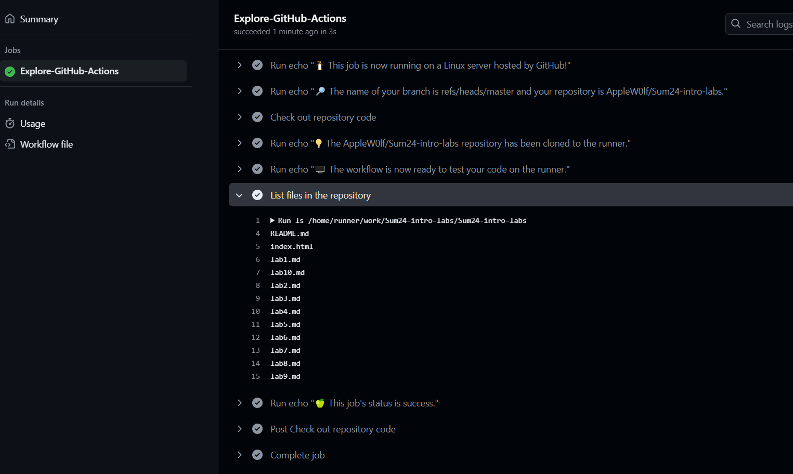
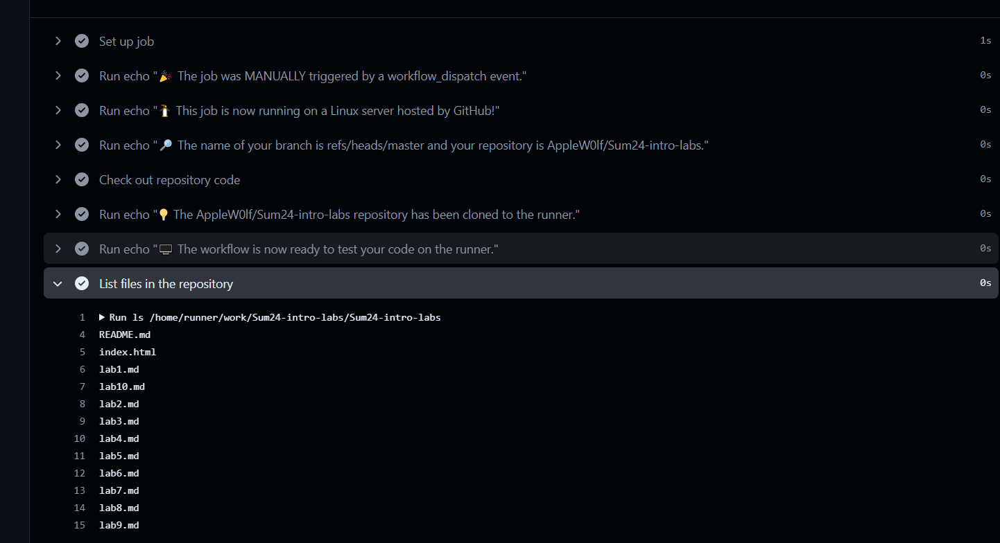
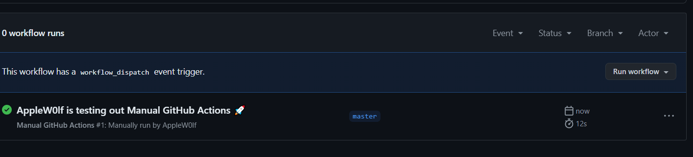
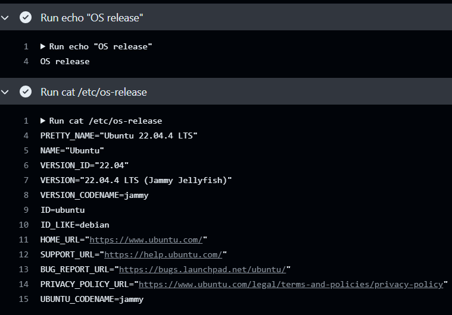
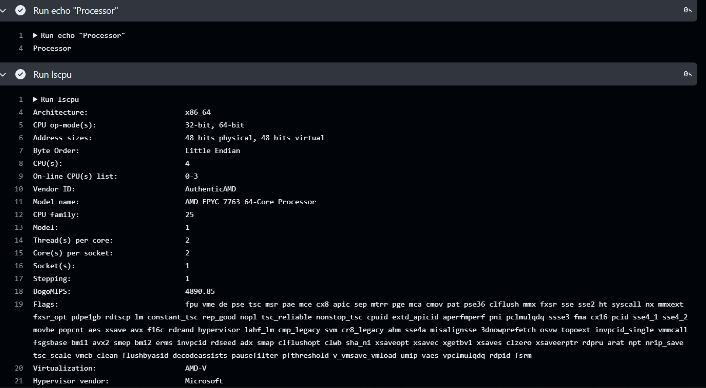
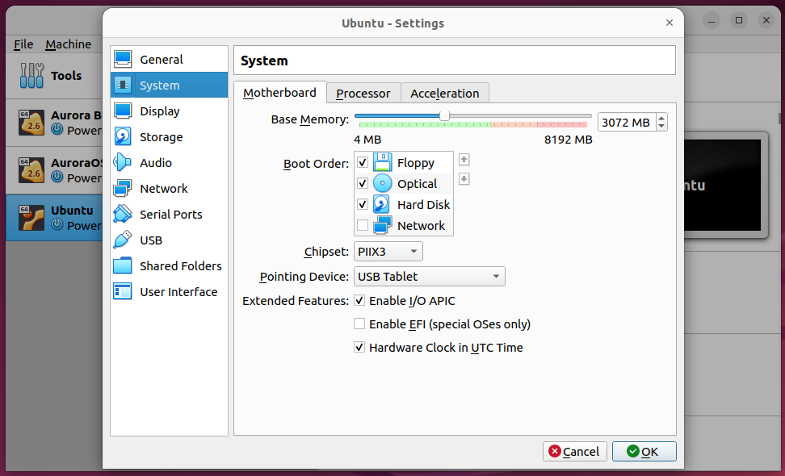

## Task 1

### 1. Creating your first workflow
Create the ``` .github/workflows ``` directory in the repository main directory. Within it create a ```github-actions-demo.yml``` file with the following contents:
```sh
name: GitHub Actions Demo
run-name: ${{ github.actor }} is testing out GitHub Actions 🚀
on: [push]
jobs:
  Explore-GitHub-Actions:
    runs-on: ubuntu-latest
    steps:
      - run: echo "🎉 The job was automatically triggered by a ${{ github.event_name }} event."
      - run: echo "🐧 This job is now running on a ${{ runner.os }} server hosted by GitHub!"
      - run: echo "🔎 The name of your branch is ${{ github.ref }} and your repository is ${{ github.repository }}."
      - name: Check out repository code
        uses: actions/checkout@v4
      - run: echo "💡 The ${{ github.repository }} repository has been cloned to the runner."
      - run: echo "🖥️ The workflow is now ready to test your code on the runner."
      - name: List files in the repository
        run: |
          ls ${{ github.workspace }}
      - run: echo "🍏 This job's status is ${{ job.status }}."

```
### 2. Commit results to the ```master``` branch and check the Actions tab on the main page:


### 3. Details of steps taken



## Task 2

### 1. Configure a manual trigger in the existing workflow.

Create a new file in the same ```.github/workflow``` directory called ```manual_trigger.yml``` with the following contents:

```sh
name: Manual GitHub Actions
run-name: ${{ github.actor }} is testing out Manual GitHub Actions 🚀
on:
  workflow_dispatch:
jobs:
  Explore-GitHub-Actions:
    runs-on: ubuntu-latest
    steps:
      - run: echo "🎉 The job was MANUALLY triggered by a ${{ github.event_name }} event."
      - run: echo "🐧 This job is now running on a ${{ runner.os }} server hosted by GitHub!"
      - run: echo "🔎 The name of your branch is ${{ github.ref }} and your repository is ${{ github.repository }}."
      - name: Check out repository code
        uses: actions/checkout@v4
      - run: echo "💡 The ${{ github.repository }} repository has been cloned to the runner."
      - run: echo "🖥️ The workflow is now ready to test your code on the runner."
      - name: List files in the repository
        run: |
          ls ${{ github.workspace }}
      - run: echo "🍏 This job's status is ${{ job.status }}."
```




### 2. Gather system information
Created ```system.yml``` file in the same ```.github/workflow``` directory with the following script:
```sh
name: System Information
run-name: ${{ github.actor }} is gathering the system information
on: [push]
jobs:
  Explore-GitHub-Actions:
    runs-on: ubuntu-latest
    steps:
      - run: echo "OS release"
      - run: cat /etc/os-release
      - run: echo "Processor"
      - run: lscpu
      - run: echo "RAM"
      - run: free -m

```

#### OS details:


#### Processor details:


#### Memory details:
