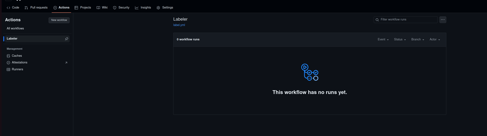
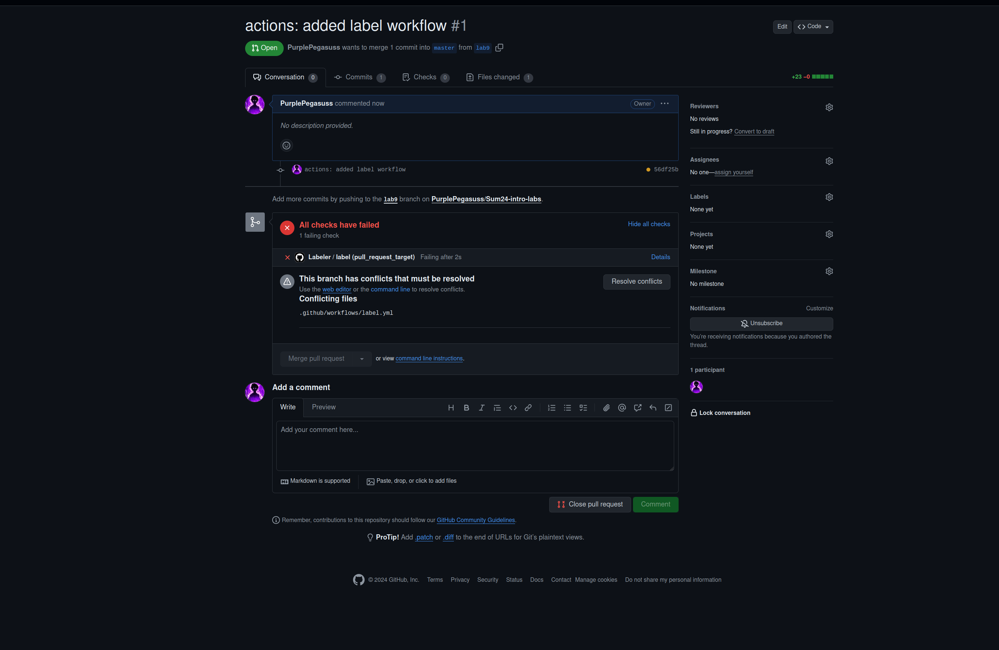
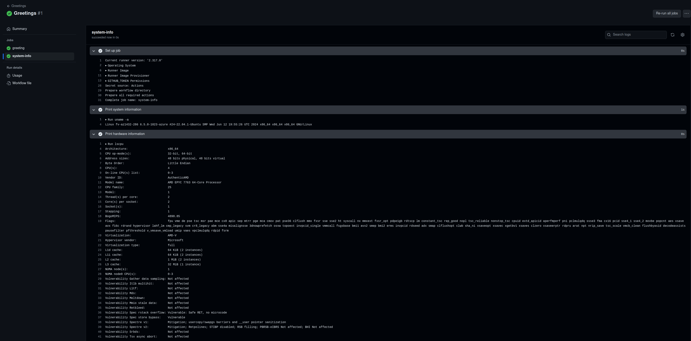
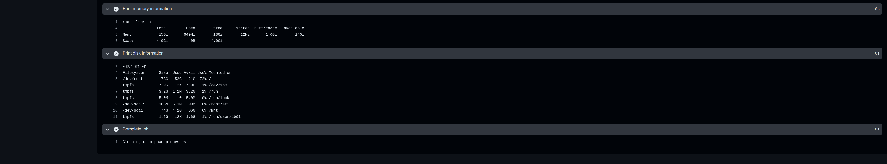

## Task 1: Create Your First GitHub Actions Pipeline

In my repository I created a config file listing an 'Label' action from github. This workflow will triage pull requests and apply a label based on the paths that are modified in the pull request.

```
touch label.yml
```

```
mv label.yml .github/workflow/
```
I filled label.yml with workflow configuration in order for it to work:
```
# This workflow will triage pull requests and apply a label based on the
# paths that are modified in the pull request.
#
# To use this workflow, you will need to set up a .github/labeler.yml
# file with configuration.  For more information, see:
# https://github.com/actions/labeler

name: Labeler
on: [pull_request_target]

jobs:
  label:

    runs-on: ubuntu-latest
    permissions:
      contents: read
      pull-requests: write

    steps:
    - uses: actions/labeler@v4
      with:
        repo-token: "${{ secrets.GITHUB_TOKEN }}"

```

We can specify system version, permissions of this workflow, and its credentials.  We give our GH token for it in order for it to perform action with our PRs.

And we push this commit. 

We can now see the labeler in actions UI:



Anytime I open a PR, our Labeler will perform an action on it:



Thus, our action works as intended! 

## Task 2: Gathering System Information and Manual Triggering

1. **Configure a Manual Trigger**:

By the time I started doing task 2, I decided to switch to Greetings action.

To add manual triggering I added the 'workflow_dispatch line':

```
name: Greetings

on:
  pull_request_target:
  issues:
  workflow_dispatch:

jobs:
  greeting:
    runs-on: ubuntu-latest
    permissions:
      issues: write
      pull-requests: write
    steps:
    - uses: actions/first-interaction@v1
      with:
        repo-token: ${{ secrets.GITHUB_TOKEN }}
        issue-message: "Message that will be displayed on users' first issue"
        pr-message: "Message that will be displayed on users' first pull request"
```

2. **Gather System Information**:

I also modified the workflow to run an additional step for gathering system info:

```name: Greetings

on:
  pull_request_target:
  issues:
  workflow_dispatch:

jobs:
  greeting:
    runs-on: ubuntu-latest
    permissions:
      issues: write
      pull-requests: write
    steps:
    - uses: actions/first-interaction@v1
      with:
        repo-token: ${{ secrets.GITHUB_TOKEN }}
        issue-message: "Message that will be displayed on users' first issue"
        pr-message: "Message that will be displayed on users' first pull request"


  system-info:
    runs-on: ubuntu-latest
    steps:
    - name: Print system information
      run: uname -a
    
    - name: Print hardware information
      run: lscpu
    
    - name: Print memory information
      run: free -h
    
    - name: Print disk information
      run: df -h
````
I intentionally split steps in different names for more structural approach. If I'd want, I can do everything with single run using | .

Let's push it and run it to see the output.






We ran an action manually and were able to see the Hardware output of the system.