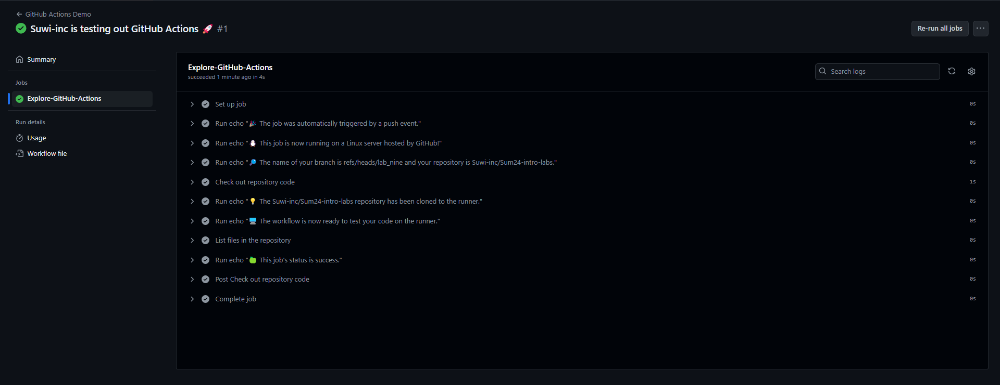
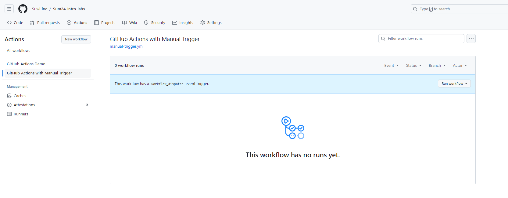
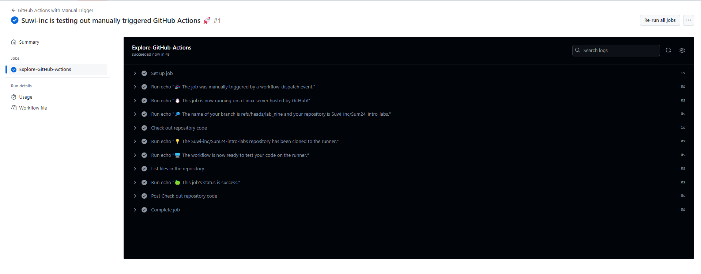
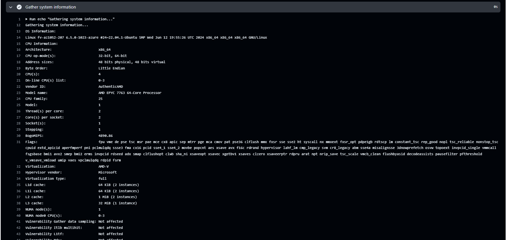
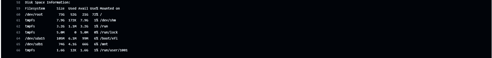

# Lab 9 : CI/CD Lab - GitHub Actions

## Task 1: Create Your First GitHub Actions Pipeline


1. **Read the Official Guide**:
- First we create a workflow file called `github-actions-demo.yml` in the `.github/workflows` directory.
    ```sh
    suwil@SUWILANJI-PCV3 MINGW64 ~/Desktop/First Year Masters/Third Semester/Devops/Lab 1/Sum24-intro-labs (lab_nine)
    $ ls .github/workflows
    github-actions-demo.yml
    ```
- Contents of the workflow file.
    ```sh
    name: GitHub Actions Demo
    run-name: ${{ github.actor }} is testing out GitHub Actions 🚀
    on: [push]
    jobs:
    Explore-GitHub-Actions:
        runs-on: ubuntu-latest
        steps:
        - run: echo "🎉 The job was automatically triggered by a ${{ github.event_name }} event."
        - run: echo "🐧 This job is now running on a ${{ runner.os }} server hosted by GitHub!"
        - run: echo "🔎 The name of your branch is ${{ github.ref }} and your repository is ${{ github.repository }}."
        - name: Check out repository code
            uses: actions/checkout@v4
        - run: echo "💡 The ${{ github.repository }} repository has been cloned to the runner."
        - run: echo "🖥️ The workflow is now ready to test your code on the runner."
        - name: List files in the repository
            run: |
            ls ${{ github.workspace }}
        - run: echo "🍏 This job's status is ${{ job.status }}."

    ```
- After commiting and pushing some changes to the branch the workflow file is ran.

    

## Task 2: Gathering System Information and Manual Triggering

1. **Configure a Manual Trigger**:
- To run a workflow manually, the workflow must be configured to run on the workflow_dispatch event.To trigger the `workflow_dispatch` event, the workflow must be in the default branch, in this case i made my `lab_nine` branch the default to enable the maual trigger.\
- First i created a workflow file `manual-trigger.yml` in the `.github/workflows` directory and added a `on workflow_dispatch` event.
    ```sh
    name: GitHub Actions with Manual Trigger
    run-name: ${{ github.actor }} is testing out manually triggered GitHub Actions 🚀
    on: workflow_dispatch
    jobs:
    Explore-GitHub-Actions:
        runs-on: ubuntu-latest
        steps:
        - run: echo "🎉 The job was manually triggered by a ${{ github.event_name }} event."
        - run: echo "🐧 This job is now running on a ${{ runner.os }} server hosted by GitHub!"
        - run: echo "🔎 The name of your branch is ${{ github.ref }} and your repository is ${{ github.repository }}."
        - name: Check out repository code
            uses: actions/checkout@v4
        - run: echo "💡 The ${{ github.repository }} repository has been cloned to the runner."
        - run: echo "🖥️ The workflow is now ready to test your code on the runner."
        - name: List files in the repository
            run: |
            ls ${{ github.workspace }}
        - run: echo "🍏 This job's status is ${{ job.status }}."
    ```
- After pushing the workflow file to the branch a new workflow appears in my actions tab with an option to manaually trigger the workflow.

    

- Once triggered the workflow runs and gives the following output:

    


2. **Gather System Information**:
- I created a workflow file with an additional step to collect the system specifications.
    ```sh
    name: System Specifications
    run-name: ${{ github.actor }} is testing out system specifications 🚀
    on: [push]
    jobs:
    Explore-GitHub-Actions:
        runs-on: ubuntu-latest
        steps:
        - run: echo "🎉 The job was triggered by a ${{ github.event_name }} event."
        - run: echo "🐧 This job is now running on a ${{ runner.os }} server hosted by GitHub!"
        - run: echo "🔎 The name of your branch is ${{ github.ref }} and your repository is ${{ github.repository }}."
        - name: Check out repository code
            uses: actions/checkout@v4
        - run: echo "💡 The ${{ github.repository }} repository has been cloned to the runner."
        - run: echo "🖥️ The workflow is now ready to test your code on the runner."
        - name: Gather system information
            run: |
            echo "Gathering system information..."
            echo "OS Information:"
            uname -a
            echo "CPU Information:"
            lscpu
            echo "Memory Information:"
            free -h
            echo "Disk Space Information:"
            df -h
        - name: List files in the repository
            run: |
            ls ${{ github.workspace }}
        - run: echo "🍏 This job's status is ${{ job.status }}."
    ```
- After running the workflow, the system specs are shown in the job `Gathering system information`
- CPU and OS specs:
    
- Memory specs:
    
- Disk specs:
    


