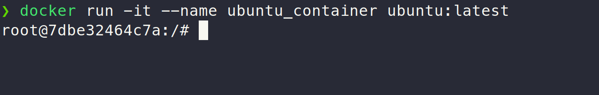
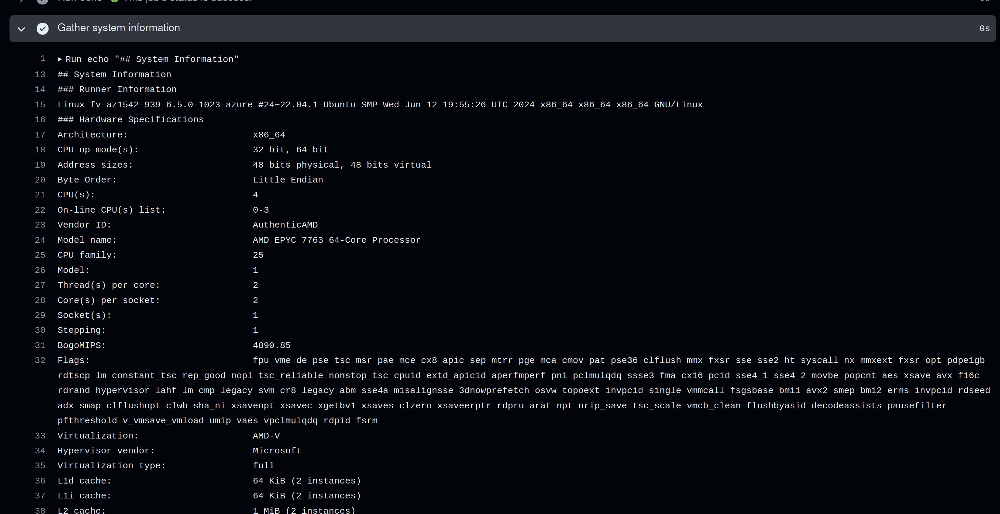

# Lab 9 submission

## Task 1



> I simply copied the demo action from the official GitHub tutorial. Some important concepts to keep in mind for defining Github actions: The trigger, jobs (and how they can depend on each other), and the runner used (In my case Im just using the latest Github-hosted Ubuntu runner). I added the file in the `.github/workflows` directory of this repo.


## Task 2

### Adding a manual trigger

I simply changed line 3 of the file from:

```yaml
on: [push]
```

to:

```yaml
on:
  push:
  workflow_dispatch:
```


### Gathering system information

> The workflow file is updated accordingly. Output below.




```
## System Information
### Runner Information
Linux fv-az1542-939 6.5.0-1023-azure #24~22.04.1-Ubuntu SMP Wed Jun 12 19:55:26 UTC 2024 x86_64 x86_64 x86_64 GNU/Linux
### Hardware Specifications
Architecture:                       x86_64
CPU op-mode(s):                     32-bit, 64-bit
Address sizes:                      48 bits physical, 48 bits virtual
Byte Order:                         Little Endian
CPU(s):                             4
On-line CPU(s) list:                0-3
Vendor ID:                          AuthenticAMD
Model name:                         AMD EPYC 7763 64-Core Processor
CPU family:                         25
Model:                              1
Thread(s) per core:                 2
Core(s) per socket:                 2
Socket(s):                          1
Stepping:                           1
BogoMIPS:                           4890.85
Flags:                              fpu vme de pse tsc msr pae mce cx8 apic sep mtrr pge mca cmov pat pse36 clflush mmx fxsr sse sse2 ht syscall nx mmxext fxsr_opt pdpe1gb rdtscp lm constant_tsc rep_good nopl tsc_reliable nonstop_tsc cpuid extd_apicid aperfmperf pni pclmulqdq ssse3 fma cx16 pcid sse4_1 sse4_2 movbe popcnt aes xsave avx f16c rdrand hypervisor lahf_lm cmp_legacy svm cr8_legacy abm sse4a misalignsse 3dnowprefetch osvw topoext invpcid_single vmmcall fsgsbase bmi1 avx2 smep bmi2 erms invpcid rdseed adx smap clflushopt clwb sha_ni xsaveopt xsavec xgetbv1 xsaves clzero xsaveerptr rdpru arat npt nrip_save tsc_scale vmcb_clean flushbyasid decodeassists pausefilter pfthreshold v_vmsave_vmload umip vaes vpclmulqdq rdpid fsrm
Virtualization:                     AMD-V
Hypervisor vendor:                  Microsoft
Virtualization type:                full
L1d cache:                          64 KiB (2 instances)
L1i cache:                          64 KiB (2 instances)
L2 cache:                           1 MiB (2 instances)
L3 cache:                           32 MiB (1 instance)
NUMA node(s):                       1
NUMA node0 CPU(s):                  0-3
Vulnerability Gather data sampling: Not affected
Vulnerability Itlb multihit:        Not affected
Vulnerability L1tf:                 Not affected
Vulnerability Mds:                  Not affected
Vulnerability Meltdown:             Not affected
Vulnerability Mmio stale data:      Not affected
Vulnerability Retbleed:             Not affected
Vulnerability Spec rstack overflow: Vulnerable: Safe RET, no microcode
Vulnerability Spec store bypass:    Vulnerable
Vulnerability Spectre v1:           Mitigation; usercopy/swapgs barriers and __user pointer sanitization
Vulnerability Spectre v2:           Mitigation; Retpolines; STIBP disabled; RSB filling; PBRSB-eIBRS Not affected; BHI Not affected
Vulnerability Srbds:                Not affected
Vulnerability Tsx async abort:      Not affected
### Operating System Details
No LSB modules are available.
Distributor ID:	Ubuntu
Description:	Ubuntu 22.04.4 LTS
Release:	22.04
Codename:	jammy
```

