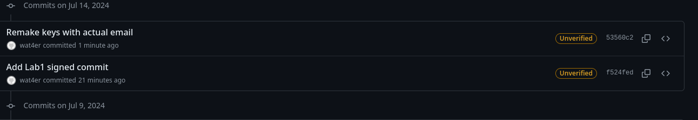
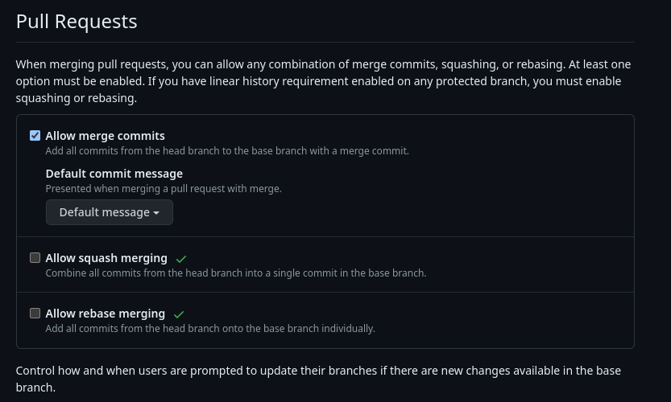

# Lab1

## Task 1

1. A brief summary explaining the benefits of signing commits.
    - The main idea of signing the commits is the same as signing anything - it is done to ensure the source of data (in this case the source of the commits). It is a way to ensure that the author of changes is legitimate, ensuring the security and integrity
2. Make a signed commit
    - Gen keys `ssh-keygen -t ed25519 -C "<e-mail>"`
    - Add private key to repo
    ```bash
    git config user.signingkey ~/.ssh/id_ed25519
    git config commit.gpgSign true
    git config gpg.format ssh
    ```
    - Commit `git add . && git commit -S -m 'Remake keys with actual email'`
    - Push `git push origin master`
    - Result:
    

## Task 2

1. A brief summary comparing these merge strategies
    - Merge commit - creates the merge commit that integrates all commits to the target branch and adds the m to the end of the history.
        - **Pros**: default approach, keeps all necessary metadata
        - **Cons**: create a banch of useless merge commits that introduce some mess to the repository.
    - Squash and Merge - combines all the commits into one big commit that is added to the target brunch in the end.
        - **Pros**: Clear repo in the end that shows the result of the repo evolution
        - **Cons**: Deletes metadata about the authors of the commits, should not use the merged brunch us could mess up alot of things (by re-commiting the changes squashed in previous merge)
    - Rebase and Merge: rewrites the git history as if all the commits had been committed to the target branch initially.
        - **Pros**: one big, clear, linear git history (used in the Trunk approach, which is an alternative to git-flow)
        - **Cons**: easy to mess up and rewrite changes that were done after
        - Commit added to the target brunch without the signature
        - Merge conflicts could not be resolved in a single commit (if 10 commits have conflicts you have to resolve it 10 time instead of one)
2. 
