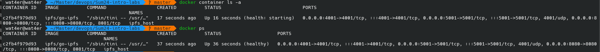
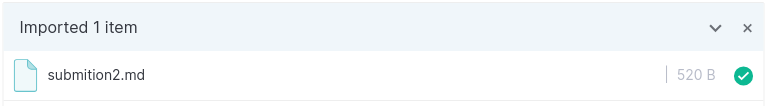
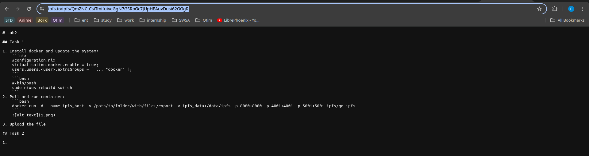
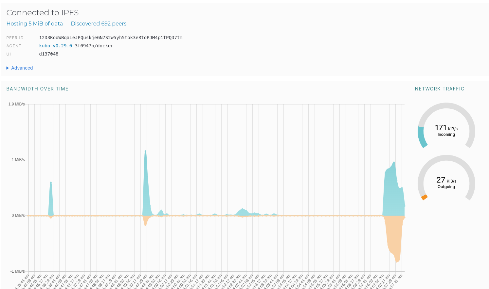

# Lab2

## Task 1

1. Install docker and update the system:
    ```nix
    #configuration.nix
    virtualisation.docker.enable = true;
    users.users.<user>.extraGroups = [ ... "docker" ];
    ```
    ```bash
    #/bin/bash
    sudo nixos-rebuild switch
    ```
2. Pull and run container:
    ```bash
    docker run -d --name ipfs_host -v /path/to/folder/with/file:/export -v ipfs_data:/data/ipfs -p 8080:8080 -p 4001:4001 -p 5001:5001 ipfs/go-ipfs
    ```
    
    
3. Upload the file:
    

4. get the file with [the link](https://ipfs.io/ipfs/QmZNCtCsiTmifuiveGgN7GSRoGc7JUpHEAuvDusi62GGgR) (hash **QmZNCtCsiTmifuiveGgN7GSRoGc7JUpHEAuvDusi62GGgR**)
    

5. Peers and bandwith
    

## Task 2

1. IPFS hash: [bafybeiczcndqwxvgv5gkam7hufozheazefkrbgnvgb6es7n3oj6qjwwj3u](http://ipfs.io/ipfs/bafybeiczcndqwxvgv5gkam7hufozheazefkrbgnvgb6es7n3oj6qjwwj3u)
2. site: [https://early-bit-deep.on-fleek.app/](https://early-bit-deep.on-fleek.app/)