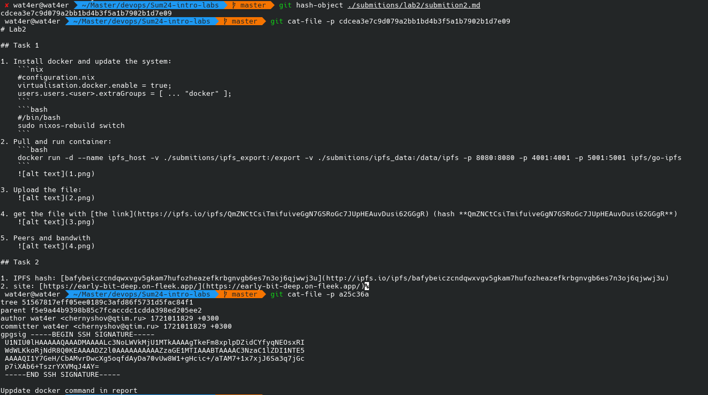
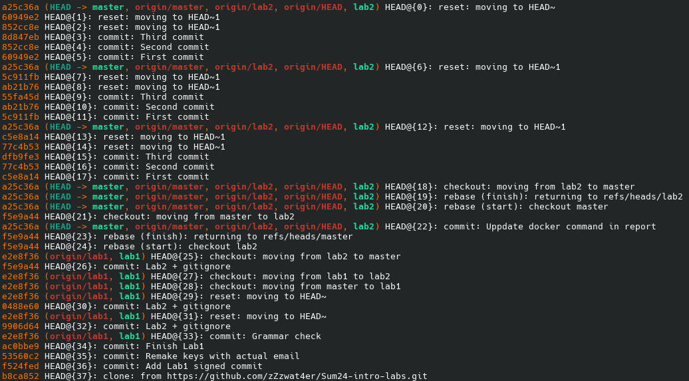

# Lab3

## Task 1

1. try `git cat-file`
    

## Task 2

1. make all commits:
    - file
    ```
    First commit
    Second commit
    Third commit
    ```
    - git status
    ```
    On branch master
    Your branch is ahead of 'origin/master' by 3 commits.
    (use "git push" to publish your local commits)

    Untracked files:
    (use "git add <file>..." to include in what will be committed)
            submitions/lab3/
    ```
2. Make soft reset
    - File
    ```
    First commit
    Second commit
    Third commit
    ```
    - git status
    ```
    Your branch is ahead of 'origin/master' by 2 commits.
    (use "git push" to publish your local commits)

    Changes to be committed:
    (use "git restore --staged <file>..." to unstage)
            modified:   file.txt

    Untracked files:
    (use "git add <file>..." to include in what will be committed)
            submitions/lab3/
    ```
3. Make hard reset
    - File
    ```
    First commit
    ```
    - git status
    ```
    On branch master
    Your branch is ahead of 'origin/master' by 1 commit.
    (use "git push" to publish your local commits)

    Untracked files:
    (use "git add <file>..." to include in what will be committed)
            submitions/lab3/
    ```
4. make mixed reset (default)
    - File
    ```
    First commit
    ```
    - Git status
    ```
    On branch master
    Your branch is up to date with 'origin/master'.

    Untracked files:
    (use "git add <file>..." to include in what will be committed)
            file.txt
            submitions/lab3/

    nothing added to commit but untracked files present (use "git add" to track)
    ```
5. `git reflog` (yes it took me 3 attempts)


6. `git reset --hard <hash_from_reflog>`
    - file
    ```
    First commit
    Second commit
    Third commit
    ```
    - git status
    ```
    On branch master
    Your branch is ahead of 'origin/master' by 3 commits.
    (use "git push" to publish your local commits)

    Untracked files:
    (use "git add <file>..." to include in what will be committed)
            submitions/lab3/
    ```
7. Explonation
    - `git reset`: based on experience, use cases `reset` moves the head between the different commits according to the selected mode. From "GIT-RESET(1)" man and based on the output of file/git status, the modes work as follows:
        - **soft**: just relocate the HEAD with no changes to git storage (index) or local fs (tree)
        - **mixed** (default): move head to the target commit and update git storage (index) without updating the local fs (tree)
        - **hard**: move the head to the target commit and update both fit storage (index) and local fs (tree)
    - `git reflog`: this is the log changes of the current branch hash as it logs all the commits, resets, checkouts, and rebases (if it were only commits and resets, I could have assumed it was a log of all HEAD changes).
    - `HEAD~<int>` commit relative to the head down (e.g. `HEAD~/HEAD~1` - 1 commit before head, `HEAD~10` 10 commits before head)
8. Hard reset to HEAD~3 (don't want to keep trash in the repo :))