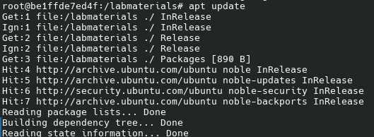
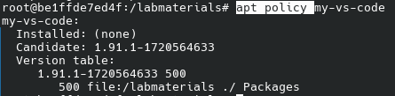
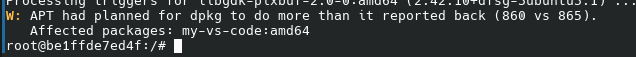
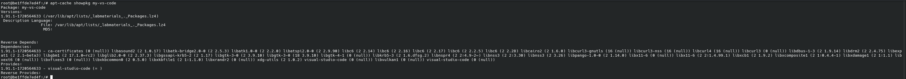
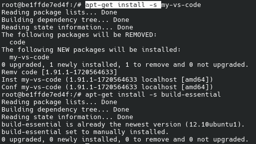
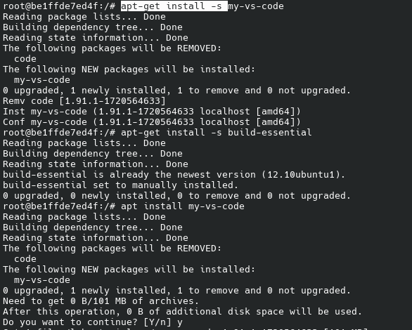
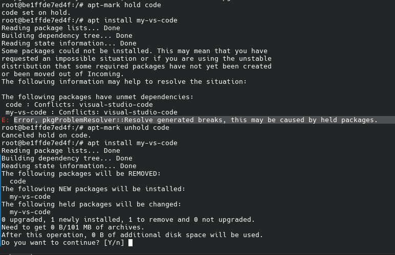

# Lab4

## Note from personal hands-on experience

    - Pacman is mach faster than the apt since it is just faster by itself and allows for parrallel download since recently (before powerpill was used, and I'm not sure about parralel download in apt)
    - Pacman is more convenient (maybe just a preference), especially since AUR package managers, such as yay and paru, provide very convenient package locations (they have search)
    - So the arch/manjaro would be the distribution to install :-) if it were stable
    - As a result, I end up using NixOS since it is something new and exotic :)
    - Due to I refusal to use ubuntu/debian this lab was done in a Docker container

## Task 1

1. Run the container with ubuntu
    ```bash
    docker run -it --name=devopsLab-v./submitions/lab4/ubuntuVol:/labmaterials--entrypoint/bin/bashubuntu
    ```
2. if required, you could access the container with `docker start -ai devopsLab`
3. Install dpkg-dev
    ```bash
    apt update
    apt-get install dpkg-dev
    ```
4. Generate a package index:
    ```bash
    dpkg-scanpackages ./ /dev/null | gzip-9c > ./Packages.gz
    ```
5. Update package name with vim:
    ```
    # zcat Packages.gz
    Package: my-vs-code
    Version: 1.91.1-1720564633
    Architecture: amd64
    Maintainer: Microsoft Corporation <vscode-linux@microsoft.com>
    Installed-Size: 388720
    Depends: ca-certificates, libasound2 (>= 1.0.17), libatk-bridge2.0-0 (>= 2.5.3), libatk1.0-0 (>= 2.2.0), libatspi2.0-0 (>= 2.9.90), libc6 (>= 2.14), libc6 (>= 2.16), libc6 (>= 2.17), libc6 (>= 2.2.5), libc6 (>= 2.28), libcairo2 (>= 1.6.0), libcurl3-gnutls | libcurl3-nss | libcurl4 | libcurl3, libdbus-1-3 (>= 1.9.14), libdrm2 (>= 2.4.75), libexpat1 (>= 2.1~beta3), libgbm1 (>= 17.1.0~rc2), libglib2.0-0 (>= 2.37.3), libgssapi-krb5-2 (>= 1.17), libgtk-3-0 (>= 3.9.10), libgtk-3-0 (>= 3.9.10) | libgtk-4-1, libkrb5-3 (>= 1.6.dfsg.2), libnspr4 (>= 2:4.9-2~), libnss3 (>= 2:3.30), libnss3 (>= 3.26), libpango-1.0-0 (>= 1.14.0), libx11-6, libx11-6 (>= 2:1.4.99.1), libxcb1 (>= 1.9.2), libxcomposite1 (>= 1:0.4.4-1), libxdamage1 (>= 1:1.1), libxext6, libxfixes3, libxkbcommon0 (>= 0.5.0), libxkbfile1 (>= 1:1.1.0), libxrandr2, xdg-utils (>= 1.0.2)
    Recommends: libvulkan1
    Conflicts: visual-studio-code
    Replaces: visual-studio-code
    Provides: visual-studio-code
    Filename: ./code_1.91.1-1720564633_amd64.deb
    Size: 100924046
    MD5sum: 04821bd56f47d5fbe8bf8f621e791437
    SHA1: 48d095107eeb17f256952d7a7c0bfb2045d3221d
    SHA256: 31a13c05295f3349d3dc168d9c67dda4fcf30823fe3c34f215f0324d197f5479
    Section: devel
    Priority: optional
    Homepage: https://code.visualstudio.com/
    Description: Code editing. Redefined.
    Visual Studio Code is a new choice of tool that combines the simplicity of
    a code editor with what developers need for the core edit-build-debug cycle.
    See https://code.visualstudio.com/docs/setup/linux for installation
    instructions and FAQ.
    ```
6. Add repo to the source list
    ```bash
    echo "deb [trusted=yes] file:/labmaterials ./" | tee/etc/apt/sources.list.d/local-apt-repo.list
    sudo apt update
    ```

    

7. verify package exist

    

8. Install package with `apt install my-vs-code`

    

## Task 2

1. Use `apt-cache showpkg my-vs-code`
    - It provides all the dependancies for vscode, as well as reverse dependancies (no in case of vscode) and providers.

    

2. simulate installation with the `-s` flag
    - It provides information about the current state of the package in a system and what packages would be affected by the installation process (in the case of a custom pkg re-installation would yelld removal of code pkg and the installation of the "my-vs-code" pkg)

    

    - it is actually the same as if you try to install a package and say "no" when apt ask you to proceed with installation.
    
    

## Task 3

1. hold the code pkg with `apt-mark hold code`
2. try to reinstall "code" with "my-vs-code"
    - the result is an error due to held pkg
    ```
    Error, pkgProblemResolver::Resolve generated breaks, this may be caused by held packages.
    ```
3. unhold "code" pkg
    - the installation of "my-vs-code" did not yelld an exeption anymore

    