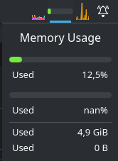
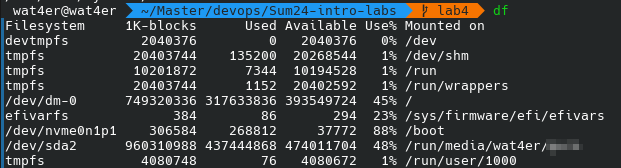

# Lab5

## Task 1

1. install htop and iostat (cause who needs it by default in their linux :))

    ```nix
    # configuration.nix
    environment.systemPackages = with pkgs; [
        ...
        # lab5 
        htop
        sysstat
    ];
    ```
    - by the way there are nice graphs for personal linux :) (swap was never configured, that is why in mem usage second graph shows nan)

      

2. `htop` 
    - sort with "f6"
    - top CPU utilisation: wayland, htop, chrome
    - top MEM utilization: chrome, plasma, vscode (a lot of processe for each app)
    - top IO utilisation: chrome, vscode (none of other apps used IO at all in a minute)
3. `iostat`

    

4. `df`
    
    

5. `du`

    

    - top 3 most havy directories in `/var`: docker, journal, sddm
    - Im not going deeper then 2, and I did not found sort flag in `du` so thats it)
    - note from expiriance: `du` prove quite useful to locate useless files in a system when I had to free some space

## Task 2

1. All the staff related to terraform could be found [here](./terraform/terraform.md)