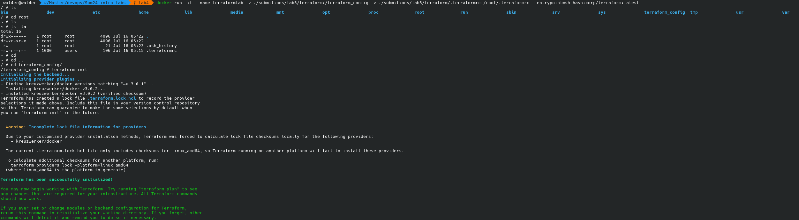
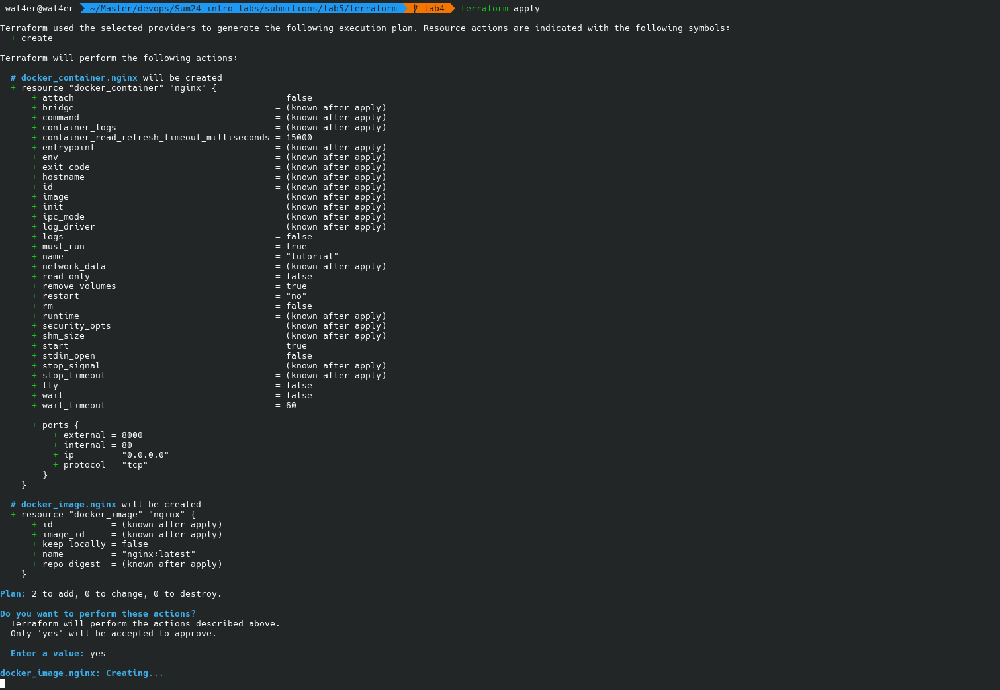
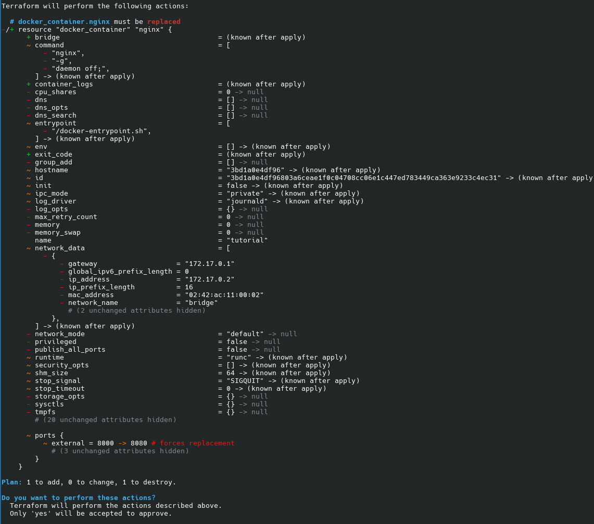
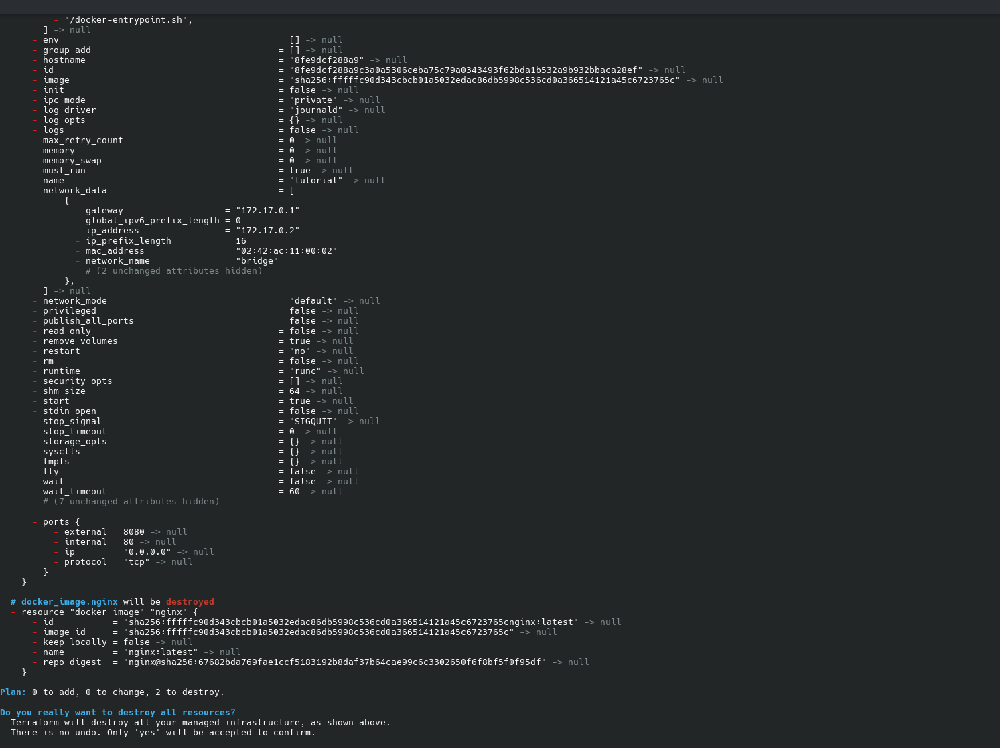

# Terraform

## Task 2

1. Run terraform container (cause why not)

    ```
    docker run -it --name terraformLab -v ./submitions/lab5/terraform:/terraform_config --entrypoint=sh hashicorp/terraform:latest
    ```
    
2. Create "main.tf" according to the build guide
    ```tf
    terraform {
        required_providers {
            docker = {
            source = "kreuzwerker/docker"
            version = "~> 3.0.1"
            }
        }
        }

        provider "docker" {}

        resource "docker_image" "nginx" {
        name         = "nginx:latest"
        keep_locally = false
        }

        resource "docker_container" "nginx" {
        image = docker_image.nginx.image_id
        name  = "tutorial"
        ports {
            internal = 80
            external = 8000
        }
    }
    ```

3. Try to `terraform init` and fail since we are in Russia

4. change the provided mirror to some random mirror from random habr article and sucseed in `terraform init`. Also make a volume for `.terraformrc`
    ```
    docker run -it --name terraformLab -v ./submitions/lab5/terraform:/terraform_config -v ./submitions/lab5/terraform/.terraformrc:/root/.terraformrc --entrypoint=sh hashicorp/terraform:latest
    ```

    

5. Format and validate

    ```
    /terraform_config # terraform fmt
    main.tf
    /terraform_config # terraform validate
    Success! The configuration is valid.
    ```

6. Realize there is no docker inside terraform container and give up while installing it

7. Install terraform localy and put `.terraformrc` to home dir

8. apply the configuration

    
    ```
    terraform state list
    docker_container.nginx
    docker_image.nginx
    ```

9. Change the config and apply changes

    

10. destroy the config

    

## Some lab stuff

- terraform version: v1.8.5
- instalation process??? (have no idea why you need it, it is not a rocket science after all): 
    - add terraform to NixOS config file and rebuild the system
    - or `pacman -S terraform`
    - or `apt-get install terraform`
    - or (for Alpine)
        ```sh
        wget https://releases.hashicorp.com/terraform/0.12.21/terraform_0.12.21_linux_amd64.zip
        unzip terraform_0.12.21_linux_amd64.zip && rm terraform_0.12.21_linux_amd64.zip
        mv terraform /usr/bin/terraform
        ```