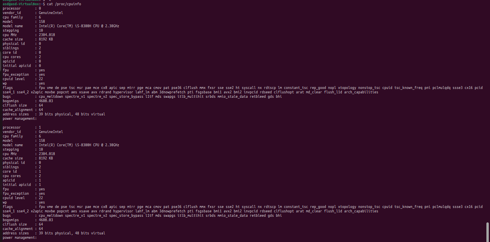

# Lab7

## Task 1

1. install VirtualBox
    ```nix
    # configuyration.nix
    virtualisation.virtualbox.host.enable = true;
    ```
    - virtualbox version 
        ```
        Oracle VM VirtualBox VM Selector v7.0.18
        Copyright (C) 2005-2024 Oracle and/or its affiliates
        ```
2. add vbox group to user
    ```nix
    # configuration.nix
    users.users.wat4er.extraGroups = [ ... "vboxusers" ];
    ```

3. ubuntu instalation
    - most of configuration is still default
    - So we have 
        - 2 CPU cores (instead of 1)
        - 2GB of RAM
        - 25GB of disk space

    
    
    

## Task 2

1. cpu
    `cat /proc/cpuinfo`
    

2. memory
    `cat /proc/meminfo`
    

3. OS
    `cat /etc/os-release`
    

4. `inxi -F`
    