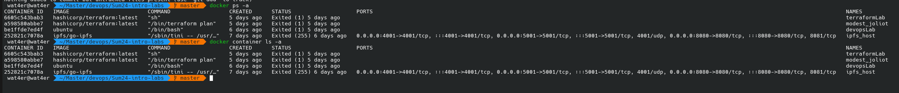
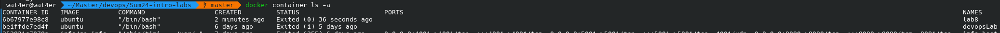
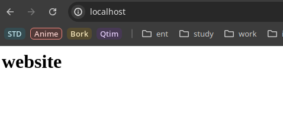
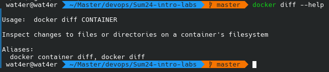
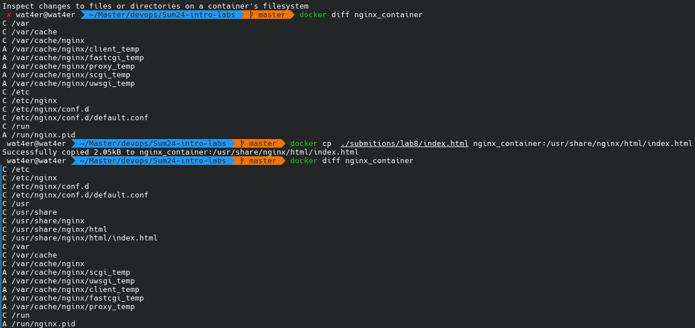

# Lab8

## Task 1

1. to list all the containers we could use `docker ps -a` (it is a shortcut I was looking for a long time) but `docker container ls -a` is also an appropriate command that does the same
    

2. I won't pull ubuntu since I already did resently (see [lab4](../lab4/submition4.md)). Also if it is a public image it could be pulled with `docker run <image>` in case it is not present in a system. However, it won't update witout pull

3. Run ubuntu container with `docker run -it --name lab8 ubuntu`. In lab4 id did extra work by providing an `--entrypoint` to the container since initially I forgot about `it` flags. Nevertheless, results are the same
    

4. If attempt to remove image there would be an error since there are containers that uses this image. The containers could be removed with `docker rm <container_name/container_hash>`

5. Also `docker rm` and `docker rmi` are a shortcuts for `docker container rm` and `docker image rm` respectively as well as `docker ps` is a shortcut for `docker container ls`

## Task 2

1. Create archive with ubntu iamge. The size is comparable
    ```
     wat4er@wat4er  ~/Master/devops/Sum24-intro-labs   master  du ./submitions/lab8/bubunta.tag -h 
    77M     ./submitions/lab8/bubunta.tag
    wat4er@wat4er  ~/Master/devops/Sum24-intro-labs   master  docker image ls                           
    REPOSITORY            TAG       IMAGE ID       CREATED       SIZE
    hashicorp/terraform   latest    af62ce8c3aed   11 days ago   115MB
    ipfs/go-ipfs          latest    2eac8d47ed7d   5 weeks ago   95.1MB
    ubuntu                latest    35a88802559d   6 weeks ago   78.1MB
    ```

2. Run nginx container with index
    - `docker run -d -p 80:80 --name nginx_container nginx`
    - `docker cp  ./submitions/lab8/index.html nginx_container:/usr/share/nginx/html/index.html`
    - 

3. Commit container `docker commit nginx_container my_website:latest`
4. Romove current container `docker stop nginx_container && docker rm nginx_container`
5. Run commited container and test with curl
    - `docker run -d -p 80:80 --name my_website_container my_website:latest`
    - `curl`
    ```
    curl localhost  
    <html>
    <head>
    <title>The best</title>
    </head>
    <body>
    <h1>website</h1>
    </body>
    </html>%                 
    ```
    
6. `docker diff`

    
    - `docker diff` shows the changes in files from the initial image build. It could be seen on the original container
        