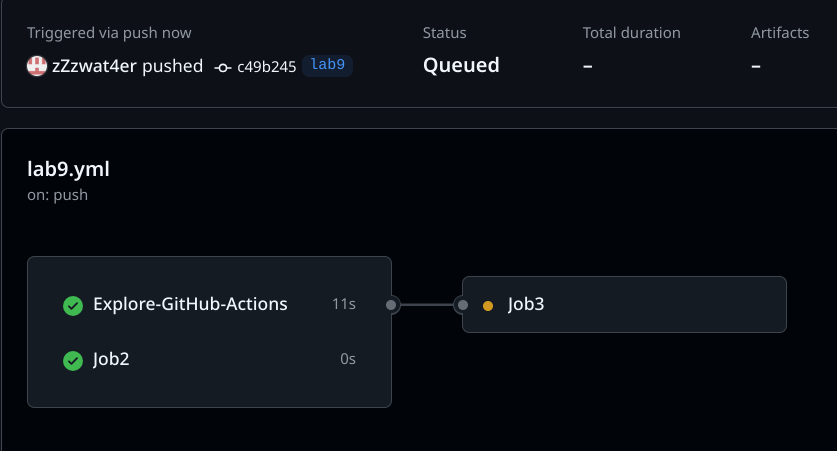
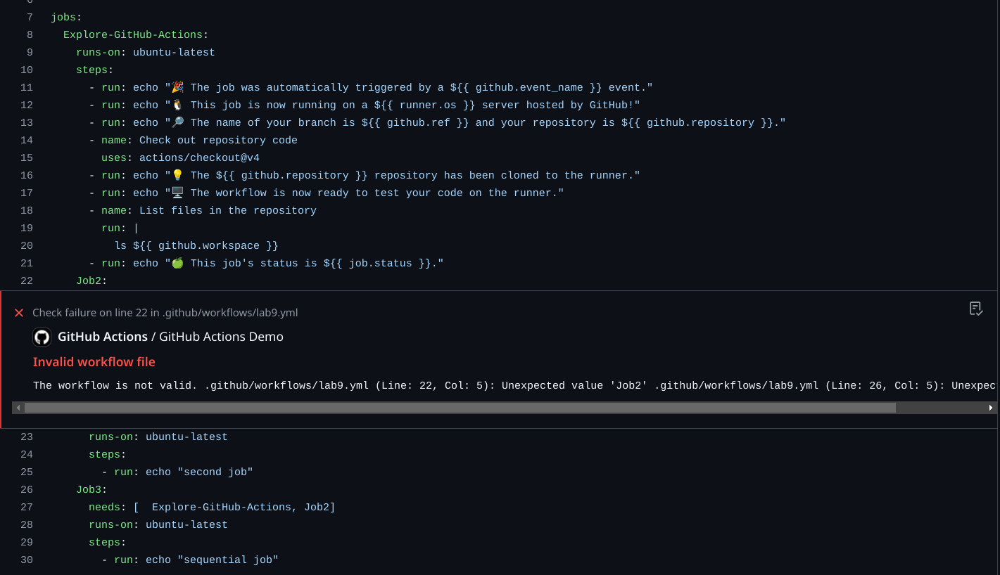
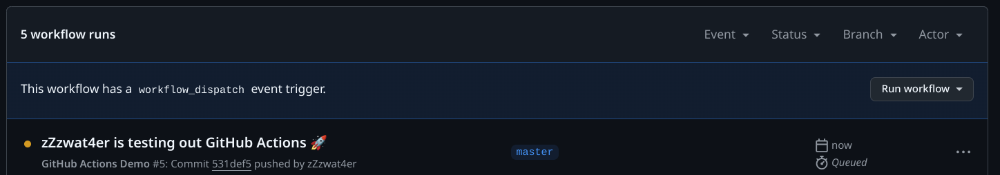
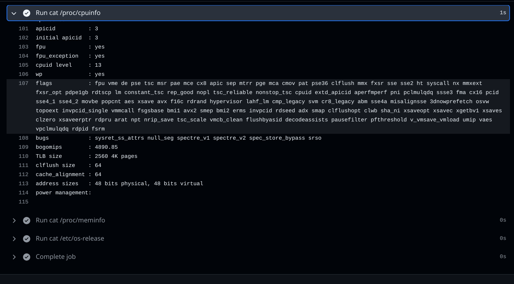
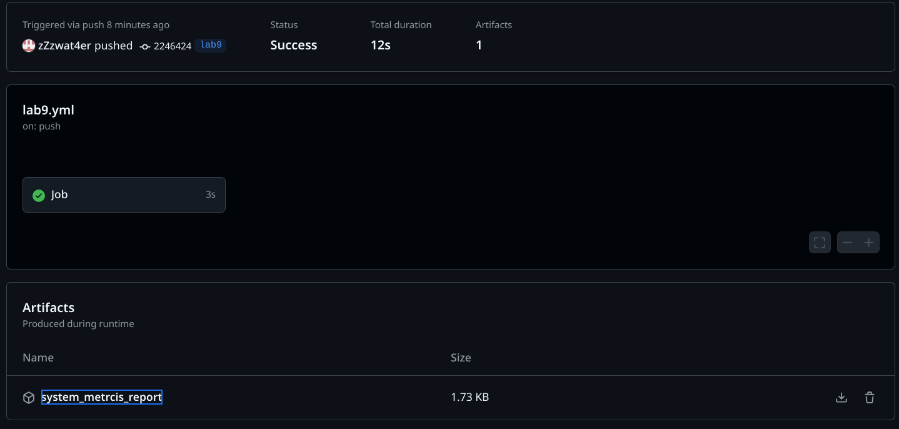

# Lab9

## Task 1

1. Create basic action from the [quick start guide](https://docs.github.com/en/actions/quickstart)
    -  Create [yml file](../../.github/workflows/lab9.yml)
    - Put the Content of example yml file provided by the guide inside
    - Push changes to a new branch
    - Observe
2. Observations:
    - We have created an actions with the name specified in `run-name` 
    
    - The provided example shows the following features of github actions
        - We could specify when to run the action with `on: [<action>]`
        - We could define a set of jobs which are the scripts that would be run by the github with `jobs:`
        - inside we could spesify the machine that would be used in order to execude the job with `runs-on: <machine>`. it could be a github machine as spesified in the example or any other runner including a self-hosted runner as spesified [here](https://docs.github.com/en/actions/writing-workflows/workflow-syntax-for-github-actions#jobsjob_idruns-on)
        - The Job consists of the steps, which are the commands executed sequentially
        - The steps could be either a terminal commands like `- run: echo "<someText>"` or third-party actions created by github users like `- uses: actions/checkout@v4`
        - The steps could have its own name defined by `- name: <step name>`
        - The actions could use environment variables. it includes:
            - Build-in vars: `github.repository`
            - Repository vars: `vars.ASDF`, `secrets.ASDF`
            - User defined vars: 
                ```yml
                env:
                    ASDF: <var content>
                jobs:
                    JoB:
                        runs-on: ubuntu-latest
                        env:
                            ASDF1: <Another var content>
                        steps:
                            - run: echo "$ASDF $ASDF1 $ASDF2"
                              env:
                                  ASDF2: <Third var:)>
                ```
        - We could run several jobs in parallel by defining several jobs
            ```yml
                Job1:
                    <job>
                Job2:
                    <job>
            ```
        - We could run jobs sequentially by specifying which jobs has to end before the following job
            ```yml
                Job1:
                    <job>
                Job2:
                    needs: [Job1]
                    <job>
            ```
        - The result of sequential and parallel jobs 
3. Random fact: If you use windows as a machine that executes a job, it could not run docker based actions. It makes a lot of third-party containers useless
4. Faced problems:
    - in yml the spaces are important as in python :3
    

## Task 2

1. Make manual trigger for action
    - add the `workflow_dispatch` trigger
    ```yml
    on: [ push, workflow_dispatch ]
    ```
    - And now it could be manually triggered
    
2. Collect system information
    - Make a new job for metric collection
    - Use all the commands that were used in Lab 7
    ```yml
    jobs:
        Job:
            runs-on: ubuntu-latest
            steps:
            - run: cat /proc/cpuinfo
            - run: cat /proc/meminfo
            - run: cat /etc/os-release
    ``` 
    - Result
    
    - Make it prettier and upload the report with performed commands
    ```yml
    jobs:
        Job:
            runs-on: ubuntu-latest
            env:
            SYS_METRICS: metrics.txt
            steps:
            - name: Collect metrics
              run: | 
                printf "CPU Info\n\n" >> $SYS_METRICS 
                cat /proc/cpuinfo >> $SYS_METRICS
                printf "Memory Info\n\n" >> $SYS_METRICS
                cat /proc/meminfo >> $SYS_METRICS
                printf "OS Info\n\n" >> $SYS_METRICS
                cat /etc/os-release >> $SYS_METRICS
            - name: Subbmit metrics
              uses: actions/upload-artifact@v4
              with:
                name: system_metrics_report
                path: ${{ env.  SYS_METRICS }}
    ```
    
    - As result we have a [txt file that holds all the metrics we collected](./metrics.txt)
    - From the collected metrics we could say that the system uses `AMD EPYC 7763 64-Core Processor` processor. And we have access to 4 cores
    - The operating system is `Ubuntu 22.04.5 LTS` as expected
    - The system has `MemTotal: 16364592 kB` which is about 16 GB of RAM
